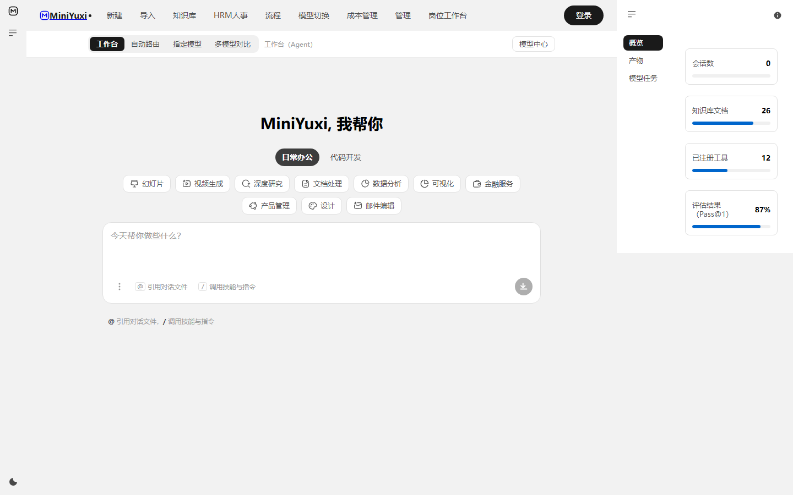

# MiniYuxi · 企业级 AI 助手（三端统一 · 本地优先 · 零 Docker）

[](LICENSE)
[](https://www.python.org)
[](tests/selftest.py)
[](https://github.com/C34W-Tsz-dzhang2-0f5/MiniYuxi/stargazers)

> **把 Agent 跑进企业工作流**——Web / Desktop / CLI 三端共享同一套内核，SQLite 单文件、零外部服务、可审计。
> 内核只写一次，三端只是外壳；工具、记忆、权限、审计天然一致。



> 🖥️ **桌面版安装包**（Windows x64，含内置 Python 内核，双击即用）：
> [MiniYuxi_0.2.0_x64_en-US.msi](https://github.com/C34W-Tsz-dzhang2-0f5/MiniYuxi/releases/latest/download/MiniYuxi_0.2.0_x64_en-US.msi)（84 MB）

## ✨ 核心特性

- 🌐 **三端统一内核**：Web（SPA）/ Desktop（Tauri sidecar）/ CLI（薄客户端）共用 `core/`，功能永远一致。
- 🏢 **多租户 + RBAC**：admin / editor / viewer 角色矩阵，租户数据隔离。
- 🤖 **Agent 编排**：ReAct 主循环 + 工具治理（toolset 过滤 + 审批门）+ 多 Provider 故障转移。
- 📚 **知识库 RAG**：BM25 + 向量 RRF 融合检索，中文 bigram 分词，sqlite-vec 零服务。
- 🛡️ **安全审计**：hardline 命令拦截 → 审批 → 路径校验 → append-only 哈希链。
- ⏰ **定时任务**：Cron = Agent 任务（fresh session 执行，未知类型 fail-closed）。
- 💾 **本地优先**：单 Python 进程、单 SQLite 文件，内存 65–70MB，备份即拷文件。

## 🚀 快速开始

### 🌐 Web 端（已可用）

```bash
git clone https://github.com/C34W-Tsz-dzhang2-0f5/MiniYuxi.git MiniYuxi && cd MiniYuxi
python -m venv .venv && source .venv/bin/activate   # Windows: .venv\Scripts\activate
pip install -r requirements.txt
cp .env.example .env                                # 填入 LLM_API_KEY / EMB_API_KEY
python run.py                                       # http://127.0.0.1:8801
python tests/selftest.py                            # 期望 20/20
```

默认账号：`default / admin / admin123`（**首次部署务必改密**）。

### 🖥️ Desktop 端（Tauri + Python sidecar · 已落地 P3）

外壳只做窗口，Python 内核以 **sidecar 常驻**，本地打开的仍是同一份 `web/index.html`：

```bash
# 1. 离线贯通（不装 Rust / Node）：7 步验证「外壳→sidecar→api.py→core/」链路
python examples/desktop_tour/code.py

# 2. 开发态（外壳跑起来，内核走源码，跳过打包）
$env:MINIYUXI_SIDECAR_PY = "$PWD\run.py"
$env:MINIYUXI_PYTHON    = "...\python.exe"        # 与 requirements.txt 一致地那个
cd apps/desktop && npm install && npm run dev

# 3. 生产打包
cd apps/desktop && npm run sidecar && npm run build   # 出 .msi / .nsis
```

完整说明（通信契约 / 打包矩阵 / 已知边界）见
[`docs/desktop.md`](docs/desktop.md) 与 [`apps/desktop/README.md`](apps/desktop/README.md)。
架构与开源增长策略见 [`docs/三端统一架构与开源增长方案.md`](docs/三端统一架构与开源增长方案.md) 第 3 节。

### ⌨️ CLI 端（已可用 · 薄客户端）

CLI 直接 `import core`（不经 HTTP，零网络开销），与 Web 共享同一内核：

```bash
python cli.py doctor                 # 环境体检（--full 跑完整自检）
python cli.py ask "劳动合同到期预警？"  # 单次问答
python cli.py chat                   # 交互式对话（/exit 退出，/new 清空上下文）
python cli.py kb list|search|add     # 知识库
python cli.py tools | skills         # 工具 / 技能清单
python cli.py serve                  # 顺手拉起 Web 服务
```

Windows 可直接双击 `miniyuxi.bat`；或 `pip install -e .` 后全局使用 `miniyuxi` 命令。

## 🏗️ 架构

```
Web / Desktop / CLI  ──┐
                        ├─→  FastAPI AppServer (api.py)  ──→  core/ 内核（单一可信源）
        localhost/HTTPS ─┘                              Agent·Tools·RAG·Memory·Security·Scheduler·Audit
```

完整三端分层、核心模块映射（对照 learn-workbuddy 24 课）与开源增长策略见 👉
**[`docs/三端统一架构与开源增长方案.md`](docs/三端统一架构与开源增长方案.md)**。

## ✅ 质量凭证

- `tests/selftest.py`：**20/20** 端到端通过
- `tests/test_hermes_landing.py`：13 passed（Hermes 原则落地）
- `tests/test_perf_optimizations.py`：5 passed（性能优化回归）
- 提交/PR 经 `.github/workflows/verify.yml` 卡点（未定义符号扫描 + 法条闸门 + 桌面端单元）

一条命令复现 CI 全部门禁（Windows 也能跑，不用等 push 才发现红）：

```bash
python scripts/verify.py           # 全量，等价 CI
python scripts/verify.py --quick    # 只跑纯 stdlib 快卡点（约 2.5s）
```

## 🔒 部署与安全红线

> 仓库**不含任何密钥**；真实 Key 经环境变量或根目录 `.env`（已忽略）提供。

- 默认 `MINIYUXI_SECRET` 为开发值、`admin/admin123` 为默认口令——**生产务必改**。
- 仅绑定 `127.0.0.1`；对内/对外访问务必套 **nginx 反代 + HTTPS**。
- SQLite 单写者，小团队可用；公网/高并发建议换 Postgres。
- 定期备份 `data/miniyuxi.db`（含向量、审计链、账号）。
- 接真实模型（可选）：`LLM_BASE_URL` / `LLM_API_KEY` / `LLM_MODEL`；不设 `EMB_API_KEY` 则仅 BM25，功能不中断。

## 🤝 贡献

欢迎 Issue / PR！详见 [`CONTRIBUTING.md`](CONTRIBUTING.md)。提交前请跑：

```bash
python scripts/verify.py
```

## 📄 协议

[MIT](LICENSE) © 2026 MiniYuxi Contributors.

---

⭐ **如果这个项目对你有帮助，请给个 Star 支持我们继续完善三端！**
