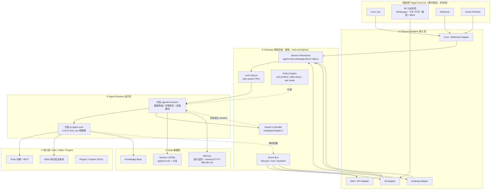
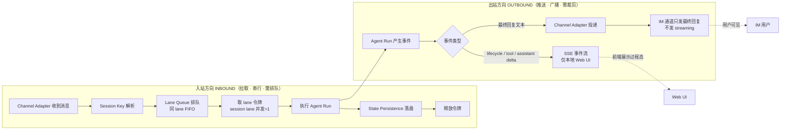
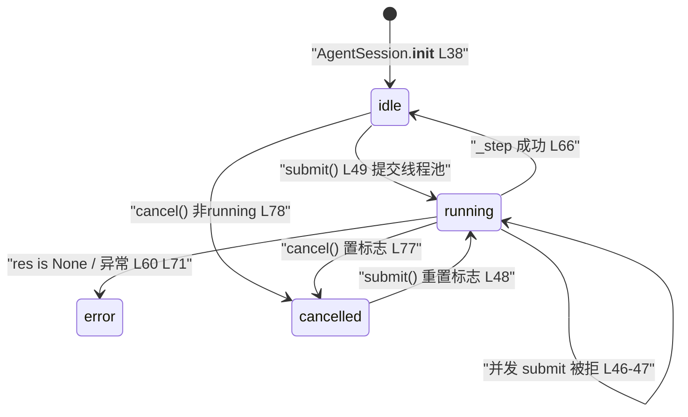

# OpenClaw Agent 调度机制五阶段技术文档 · 全面对标 Octop / WorkBuddy / MiniYuxi

> 文档日期：2026-09-30 · 范围：**仅第 1、2 阶段**（第 3/4/5 阶段由后续接手人续写）
> 对标对象：OpenClaw（MIT 开源 Agent 引擎）/ Octop（腾讯云开源自托管平台）/ WorkBuddy（腾讯闭源桌面端）/ **MiniYuxi（阿长自研 · 企业级 Agent · 零 Docker · 本地优先）**
> 证据规则：本文所有 MiniYuxi 侧陈述均来自实际源码阅读，标注 `文件:行号`；OpenClaw 侧结论来自公开源码分析（见 §0.2 事实清单）。
> 术语规则：严格对齐 `CONTEXT.md`（`agent_loop` / `egress` / `lane` / `circuit_breaker` / `provider_router` / `soc_audit` / `swarm` / `event_stream`），禁止同义异名。

---

## 0. 一句话结论 + 三方速览

### 0.1 一句话结论

> **MiniYuxi 的 `agent_loop` 已经是一个「合规优先」的 ReAct 内核——它在每一步工具执行上串起了 `circuit_breaker` 熔断、`egress` 出境收口、`approval` 审批卡、`soc_audit` 哈希链四道企业级闸门，这是 OpenClaw 内核本身没有的；真正缺的不是内核，而是内核之外的「控制平面」四件套：context compaction（上下文压缩）、memory flush（压缩前落盘）、provider failover（供应商故障转移分类）、lane queue（同会话串行队列）。**

### 0.2 OpenClaw 已核实事实清单（本文后续引用此表，编号 F1–F12）

| 编号 | 事实 | 对 MiniYuxi 的意义 |
|---|---|---|
| F1 | **双层循环**：外层 `agentCommand`（编排：模型降级、异常恢复、压缩重试）+ 内层 `pi-agent-core`（纯 `LLM→tool_use→再推理`） | MiniYuxi 只有单层；`agent_loop.run` = 内层 |
| F2 | 外层循环真实形态：`while(true){ runEmbeddedAttempt(); if success break; if contextOverflow {compactSession(); continue} if authError {rotateApiKey(); continue} break }` | MiniYuxi 缺「压缩重试」与「换 Key 重试」两种恢复 |
| F3 | 核心循环 4 阶段：Session Resolution → Context Assembly → Model Invocation（流式）→ State Persistence | MiniYuxi 阶段划分与之同构但缺 ①（无会话键解析） |
| F4 | **终止条件 = LLM 只发纯文本无 tool_use block**；**仓库层无 max-steps 限制**，靠 timeout 约束 | MiniYuxi 反其道：硬编码 `MAX_LOOPS=6` 兜底 |
| F5 | Gateway：单进程 WebSocket 服务器，默认 `127.0.0.1:18789`，Hub-and-Spoke 中心辐射；Session Key 层级化（`agent:main:main` / `agent:main:whatsapp:direct:+86...`） | MiniYuxi 无独立网关进程，`api.py` 兼任 |
| F6 | **Lane Queue**（最精巧设计）：lane-aware FIFO，纯 TS+Promise 零依赖。`session:<key>`=1（同会话严格串行）、`main`=4、`subagent`=8。保证 "Only one agent run touches a given session at a time"。队列参数 `debounceMs=1000`、`cap=20`、`drop=summarize`；消息模式 `steer/followup/collect/steer-backlog/interrupt` | MiniYuxi 只有 `status=="running"` 标志位，语义近但非队列 |
| F7 | System Prompt 组装 `buildAgentSystemPrompt`：full/minimal/none 三模式；注入顺序 `AGENTS.md → SOUL.md → TOOLS.md → IDENTITY.md → USER.md → BOOTSTRAP.md → Skills(XML) → Memory 召回 → 工具定义 → Runtime`；空文件跳过、大文件裁剪加截断标记 | MiniYuxi 是单个 `_agent_system()` 字符串拼装（`rag.py:337-369`） |
| F8 | **Model Failover**：`resolveDefaultModelForAgent` 按错误分类——`auth_error(401)`→标记 profile bad 并轮换；`billing_error(402)`→长 cooldown（默认 5h，指数增长至 24h 上限）；`rate_limit(429)`→临时 cooldown；`context_overflow`→自动 compact 重试；`timeout/overloaded`→重试。非 billing 退避 `1min→5min→25min→max 1h`。参数 `billingBackoffHours=5`、`billingMaxHours=24`、`failureWindowHours=24` | MiniYuxi 仅有「失败按序换供应商 + 固定 sleep 重试」 |
| F9 | **Compaction**：阈值 = `contextWindow − reserveTokensFloor − softThresholdTokens`（200K 窗口 → 约 176K 触发）。**Memory Flush** 最巧妙：压缩前先跑一个 silent agentic turn（用户不可见），提醒模型把持久信息写入 `memory/YYYY-MM-DD.md`，模型通常以 `NO_REPLY` 开头，投递层过滤该前缀；防重靠跟踪 `memoryFlushCompactionCount` | MiniYuxi 只有 `memory_slim` 启发式面包屑，无 flush |
| F10 | 事件流三类：`lifecycle`(start/end/error) / `tool`(tool:call/tool:result) / `assistant`(文本 delta)；外部 IM 通道**永远只发最终回复**，不发 streaming | MiniYuxi `event_stream` 三型已对齐（`agent_loop.py:42-49,68,105,114,136,149,159`） |
| F11 | **Swarm**：`maxSpawnDepth` 默认 1（防无限递归 Agent 风暴），子 Agent 独立 `sessionId` + 独立 workspace，权限冒泡（子 Agent 权限不足向上申请审批） | MiniYuxi `subagent.py` 是「生成器/评判器」闭环，非并行集群 |
| F12 | Tool Policy：tool profiles（messaging/minimal/full）+ allow/deny 列表 + exec security level（full/deny）+ ask mode（always/off）；**非 main 会话强制 Docker 沙箱** | MiniYuxi 反过来：**零 Docker**，`egress` + `security.hardline_block` + `approval` 三层替代沙箱 |

---

### 0.3 三方速览（MiniYuxi 现状实测基线 · 2026-09-30）

| 维度 | OpenClaw（MIT 开源内核） | Octop（腾讯云开源自托管） | WorkBuddy（闭源桌面端） | **MiniYuxi（自研）** |
|---|---|---|---|---|
| 进程模型 | Node 常驻 Gateway + 内嵌 runner | Python3.12 单服务 | 桌面客户端 + 内核 | Python 单进程（Web 8801 / 桌面 sidecar 8811） |
| 循环层数 | 2 层（F1） | 依赖 OpenClaw 内核 | 依赖 OpenClaw 内核 | 1 层（`agent_loop.run`） |
| 会话串行 | Lane Queue（F6） | 依赖内核 | 依赖内核 | `status=="running"` 标志位（`agent_runtime.py:47,117`） |
| 上下文压缩 | token 阈值 + Memory Flush（F9） | 依赖内核 | 依赖内核 | `memory_slim` 启发式，无 flush |
| 供应商故障转移 | 错误分类 + 长 cooldown（F8） | — | — | 顺序换供应商 + 固定 sleep（`provider_router.py:143-160`） |
| 沙箱 | 非 main 会话**强制 Docker**（F12） | 远程桌面 / 无头 Chromium | 本地文件沙箱（闭源） | **零 Docker**：`egress` + `hardline_block` + `approval` |
| 出境/安全管控 | ask mode + tool policy | OAuth + MCP 网关 | 腾讯云鉴权（闭源） | `egress.guard()` 唯一收口，5 类目的地 × 3 态策略 |
| 审计 | 账本 | — | — | `soc_audit` SHA256 哈希链，可 `verify_chain()` |
| 实测状态 | 开源可跑 | 开源可跑 | 已实测可用 | Web 8801 HTTP 200；sidecar 8811 HTTP 200；`cli.py doctor` 5/5（SQLite WAL / sqlite-vec 0.1.9 / 知识库命中 3 / 10 工具 / 45 技能） |

---

# 一、宏观架构全景

## 1.1 解决的工程问题：为什么 Agent 系统需要一个常驻控制平面

「打开进程、用完即走」的一次性脚本式 Agent，在工程上会在第 3 个真实需求上崩掉。崩点不在模型能力，而在**控制平面缺失**。以下六类问题，只有常驻控制平面能系统性解决：

| # | 工程问题 | 一次性脚本的具体表现 | 常驻控制平面的解法（OpenClaw 形态） | MiniYuxi 现状 |
|---|---|---|---|---|
| 1 | **状态无处安放** | 每次运行重建 system prompt、重灌历史，会话/记忆/技能都是临时变量 | Session Key 层级化 + append-only JSONL 落盘（`~/.openclaw/agents/<id>/sessions/<sid>.jsonl`），支持分支 | 会话在内存（`agent_runtime.py:36`），进程重启即丢；SQLite 侧有 `messages` 但循环不落盘 |
| 2 | **同一会话并发写** | 两个请求同时改一份 messages → 工具调用交错、上下文撕裂 | Lane Queue：`session:<key>` 并发度=1，硬保证单会话单次运行（F6） | 仅 `status=="running"` 拒绝（`agent_runtime.py:47-48, 117-118`）；**`status` 读写无锁保护**（`_step` 在线程池里赋值，`submit` 在请求线程读） |
| 3 | **长会话撑爆上下文** | 只能截断，截断即丢早期决策依据 | token 阈值触发 compaction + 压缩前 memory flush（F9） | `memory_slim.slim_messages()` 字符预算启发式（`memory_slim.py:34-74`），无语义摘要（`summarizer` 默认 `None`），无 flush |
| 4 | **模型供应商抖动** | 一次 429 整轮失败，用户看到"服务不可用" | 错误分类 failover + 长短 cooldown 分级（F8） | 顺序换供应商（`provider_router.py:136,143-160`），但 `agent_loop` 走的是 `gateway.chat_with_tools`（`agent_loop.py:101-102`），**根本没接 provider_router** |
| 5 | **无人值守触发** | 只能靠人点按钮 | 事件驱动触发源：cron / 24+ 渠道入站 / webhook / Gmail Pub/Sub，非轮询 | 有 `scheduler.py` + `run.py:267-280` 后台 60s 轮询线程；`connectors.py` 有健康探测与发送，但**未接入 agent_loop** |
| 6 | **过程不可见、不可干预** | 只能等最终结果 | 事件流三型（`lifecycle`/`tool`/`assistant`）实时推送 + `steer/interrupt` 消息模式（F6、F10） | `event_stream` 已实现三型（SSE，`api.py`）；但**缺 steer/interrupt 语义**——`cancel()` 只置标志位（`agent_runtime.py:75-80`），`_cancel_requested` 在 `agent_loop.run` 中**从未被读取** |

**结论**：MiniYuxi 的 `agent_loop`（内核层）已达标甚至更强，缺的是把内核包进一个常驻、可排队、可压缩、可降级、可干预的**控制平面**。这也是第 3 阶段的主线。

---

## 1.2 OpenClaw 分层与数据流

### 1.2.1 层次结构（Channel Adapters → Gateway → Agent Runtime → Tools/Skills/Plugins → Data）



### 1.2.2 两个方向必须分开看

这是 OpenClaw 设计里最容易被忽略、也是 MiniYuxi 目前最混乱的一点：**入站是「拉取 + 串行化」，出站是「推送 + 广播」**。



| 方向 | 触发方式 | 并发约束 | 内容裁剪 | MiniYuxi 对位 |
|---|---|---|---|---|
| 入站 | Adapter 主动拉取 / 事件推送 | Lane Queue 串行化（F6） | 无 | `AgentManager.submit()` 线程池 + `status` 标志（`agent_runtime.py:45-51`） |
| 出站（过程） | 事件推送 | 无需排队 | 只推 delta | `event_stream` → SSE（`agent_loop.py:42-49`） |
| 出站（结果） | 事件推送 | 无需排队 | **必须只发最终文本** | 目前只有 SSE 一路，无 IM 投递实现 |

> **工程含义**：出站的过程事件与结果事件是**两条物理通道**。MiniYuxi 把 assistant delta 直接推给前端（`agent_loop.py:114`）在 Web 场景没问题，但一旦接 IM（飞书/企微），必须补一个"delta 只进 SSE、result 才进 IM"的路由层，否则会出现"半句话发到用户微信"。

---

## 1.3 组件边界表（OpenClaw 视角 + MiniYuxi 对位）

| 组件 | 职责 | 输入 | 输出 | 状态持久化位置 | MiniYuxi 对位（真实文件） |
|---|---|---|---|---|---|
| **Channel Adapter** | 把外部通道消息转成统一入站事件；回投最终回复 | IM/Web/桌面/cron 原始消息 | 统一入站事件 | 无（无状态） | `core/connectors.py`（`register/send_message/health`）、`core/channels.py` |
| **Gateway** | 常驻控制平面：会话解析、Lane 排队、策略、事件分发、审计 | 入站事件、触发源 tick | 入队任务、出站事件 | `~/.openclaw/agents/<id>/sessions/*.jsonl`（append-only） | `api.py`（FastAPI，8801）+ `run.py` 自启动；**无独立 Gateway 进程、无 JSONL** |
| **Session Resolver** | 层级化 Session Key → 会话状态 | sessionKey | 会话上下文 | JSONL 分支树 | `agent_runtime.AgentSession`（`agent_runtime.py:28-92`），键为扁平 `session_id`（非层级） |
| **Lane Queue** | lane-aware FIFO + 并发帽 + 丢弃策略 | 入队请求 | 令牌授予 | 内存队列 | 仅 `status=="running"` 布尔拒并发（`agent_runtime.py:47,117`）；**无 FIFO、无并发帽、无 debounce/drop** |
| **Policy Engine** | tool profile / allow-deny / exec level / ask mode | 工具调用意图 | allow / deny / ask | 策略文件 | `egress.effective_mode()`（`egress.py:292-307`）+ `approval.needs_approval()`（`approval.py:43-45`）+ `tools_registry.run_tool_governed`（`tools_registry.py:311`） |
| **Agent Runtime（外层）** | 模型降级、异常恢复、压缩重试 | 一次 Agent Run 任务 | 内层循环调用 / 恢复动作 | 记忆/压缩状态 | **缺**。`agent_loop.run` 内部无外层编排 |
| **Agent Core（内层）** | ReAct 循环：推理 → 工具 → 观察 → 再推理 | messages + tools 定义 | 最终文本 + 事件流 | 本地 `messages` 变量 | `core/agent_loop.py:52-186`（`MAX_LOOPS=6`，`agent_loop.py:15`） |
| **Budget / Circuit** | 步数/超时/token/成本/租户预算/失控循环硬熔断 | 每步执行请求 | continue / open | 无（内存计数） | `core/circuit_breaker.py:BudgetGuard`（`circuit_breaker.py:21-76`），`agent_loop.py:96-99,131-135` 调用 |
| **Observability** | trace_id 贯穿 + span 落库 + 指标导出 | 每步 LLM/工具调用 | `traces` 表 | SQLite `traces`（`observability.py:45-58`） | 同名实现在 `core/observability.py`（`start_trace:18`、`span:107`、`get_metrics:111`） |
| **Audit** | 结构化事件 + 防篡改链 | 工具/出境/熔断事件 | `audit_events` 哈希链 | SQLite `audit_events`（`soc_audit.py:22-27`） | `core/soc_audit.py`（`log:43`、`verify_chain:66`） |
| **Swarm Controller** | 拆子任务 → 隔离子会话并行 → Fan-in | 大目标 | 子 Agent 结果 | 独立 sessionId + workspace | `core/subagent.py`（`delegate:43` 生成器-评判器闭环，`max_rounds=3`；**非并行**） |
| **Compactor** | 阈值触发压缩 + 压缩前 memory flush | 会话消息 + token 计数 | 压缩后消息 + flush 文件 | `memory/YYYY-MM-DD.md` | `core/memory_slim.py`（`slim_messages:34`）—— **启发式，无 flush，无 token 计数** |
| **Memory** | 语义召回 + 持久化 | query | 相关记忆条目 | SQLite memory 表 | `core/memory.py`（`recall`/`append`，`rag.py:435,453-454` 调用） |
| **Provider Router** | 多供应商 + 热切换 + 故障转移 | 供应商注册表 + prompt | 供应商响应 / 离线信封 | SQLite `llm_providers` / `kv_store`（`provider_router.py:22-28`） | `core/provider_router.py`（`chat:117`）；**`agent_loop` 未接入**（`agent_loop.py:101-102` 走 `gateway`） |
| **Tool Registry** | 工具自注册 + MCP 发现 + 治理执行 | 工具名 + args | 工具结果/错误 | 内存 `_REGISTRY` + SQLite `tools_registry` 表 | `core/tools_registry.py`（`_REGISTRY:13`、`list_tools:392`、`run_tool_governed:311`） |
| **Skills Catalog** | 技能唯一加载器，指令层注入 system prompt | 已安装技能 | 技能清单文本 | `skills_catalog` + 缓存失效 | `core/skills_catalog.py`（`inject_text()`，`rag.py:358-363` 调用） |
| **Scheduler** | 定时任务注册/到期/标记 | spec（interval/every_minutes/daily） | 到期 job 列表 | SQLite `schedules`（`scheduler.py:22-31`） | `core/scheduler.py`（`register:53`、`due_jobs:90`）+ `run.py:267-280` 60s 轮询线程 |
| **Egress Guard** | 出境唯一收口，三态策略，双份留痕 | 目的地 + 载荷 + 分级 | allow/deny/approval | `egress_policy` + `egress_log` + SOC 链（`egress.py:156-172`） | `core/egress.py`（`guard:355`、`blocked:416`）；**OpenClaw 无此层** |
| **Security Layer** | 不可恢复命令硬阻断 + 敏感路径 + 脱敏 | 命令/脚本文本 / 展示字段 | bool / 掩码串 | 无 | `core/security.py`（`hardline_block:72`、`validate_within_dir:98`、`validate_script:119`） |

---

## 1.4 四方对标：五个维度

### 1.4.1 相同点（四方共识）

| 维度 | 共识内容 |
|---|---|
| 控制平面 | 四方都认为"Agent 能力"与"Agent 编排在��"必须分离。OpenClaw 独立 Gateway 进程；Octop 把网关做进平台（含 OAuth + MCP 网关）；WorkBuddy 把内核与桌面客户端分离；MiniYuxi 用 `api.py` + `core/agent_runtime.py` 做轻量分离。**没有一家把循环直接塞进请求处理函数。** |
| 进程模型 | 四方均为**常驻进程**（或桌面端后台常驻），非"请求起进程"。MiniYuxi 为单 Python 进程 + ThreadPoolExecutor（`agent_runtime.py:23`，`max_workers=8`）。 |
| 接入面 | 四方都做"多入口 + 统一内核"。MiniYuxi 入口含 Web/桌面 sidecar/API/CLI（`cli.py doctor`）；OpenClaw 24+ IM 渠道；Octop Web/桌面/CLI/IM/API；WorkBuddy 桌面 + IM 远程触发。 |
| 状态持久化 | 四方都把会话/记忆落盘。MiniYuxi 落 SQLite（WAL + sqlite-vec 0.1.9，零 Docker）；OpenClaw 用 append-only JSONL + 分支。 |
| 沙箱 | 四方都承认"工具执行必须被限制"。OpenClaw 强制 Docker（非 main 会话）、WorkBuddy 本地文件沙箱、Octop 无头 Chromium 隔离浏览器；**MiniYuxi 走零 Docker 路线**，用 `egress` + `security.hardline_block` + `approval` 三层替代进程隔离。 |

### 1.4.2 不同点（逐维度）

| 维度 | OpenClaw | Octop | WorkBuddy | MiniYuxi |
|---|---|---|---|---|
| **控制平面** | 独立 Gateway 进程（WebSocket，`127.0.0.1:18789`），Hub-and-Spoke，双层循环（F1/F5） | 平台型：FastAPI + OAuth + MCP 网关 + 多用户 JWT 隔离；内核依赖 OpenClaw | 内核 + **闭源**编排层（专家团编排、IM 远程触发均闭源） | 轻量：`api.py` 内嵌路由 + `agent_runtime` 进程级单例；**双层循环只有单层**；`agent_loop.run` 是同步函数，直接跑在请求/线程池线程里 |
| **进程模型** | Node 单进程多协程（TS + Promise，零依赖队列） | Python 3.12 单服务（可容器化） | 桌面客户端 + 内核（闭源） | Python 3 单进程 + `ThreadPoolExecutor(8)`；设计上刻意**不做全栈 asyncio 化**以免破坏同步栈与 `egress` 收口（`agent_runtime.py:9`）；sidecar 为冻结 exe（Tauri `tauri-plugin-shell` 拉起） |
| **接入面** | 24+ IM 渠道 + webhook + cron + Gmail Pub/Sub | Web / 桌面 / CLI / IM（飞书钉钉QQ微信企微）/ API | 桌面客户端 + IM 远程触发（闭源） | Web（8801）/ 桌面 sidecar（8811）/ API / CLI；`connectors.py` 已抽象适配器框架但**未接入 agent_loop**；cron 经 `scheduler.py` + `run.py:267-280` 轮询 |
| **状态持久化** | JSONL append-only + 会话分支；`~/.openclaw/agents/<id>/sessions/<sid>.jsonl` | 平台自选（自托管） | 闭源 | SQLite 单文件（WAL）+ sqlite-vec 0.1.9；会话在内存（`AgentSession.messages`，`agent_runtime.py:36`），**进程重启即丢**；无 JSONL、无分支、无 append-only 审计外的会话轨迹 |
| **沙箱** | 非 main 会话**强制 Docker**（F12） | 远程桌面 + 无头 Chromium | 本地文件沙箱（闭源） | **零 Docker**：`security.hardline_block`（8 条不可恢复正则，`security.py:60-69`）+ `validate_within_dir`（`commonpath` 目录逃逸防护，`security.py:98-109`）+ `approval` 审批卡。代价：**无法隔离 CPU/内存/网络**，只能拦"命令字符串"与"参数值"，拦不住"工具 handler 内部行为" |

### 1.4.3 结构性差异的一句话总结

> **OpenClaw 用「进程隔离 + 队列」换安全与公平，MiniYuxi 用「策略收口 + 审批 + 审计」换零 Docker 部署 simplicity。** 这条路线是MiniYuxi 的产品定位（`CONTEXT.md` §一：零 Docker、可商用、数据可出本机）决定的，不是技术能力差距。代价必须写进设计文档：零 Docker 意味着 `egress` 收口点是**唯一**的出境防线，因此 `CONTEXT.md` §五「出境单一收口」是硬约束——**新增任何出网调用必须过 `egress.guard()`**，否则整条合规叙事不成立。

---

## 1.5 可借鉴之处：借什么、放哪个模块

| 优先级 | 借鉴项 | OpenClaw 事实 | 落到 MiniYuxi 哪个模块 | 具体做法 |
|---|---|---|---|---|
| **P0** | **Lane Queue 语义化** | F6：`session:<key>`=1 / `main`=4 / `subagent`=8；debounceMs=1000、cap=20、drop=summarize | `core/agent_runtime.py` | 把布尔 `status` 升级为 lane 对象：`{lane_key, fifo_deque, max_concurrency, drop_policy}`。`session:<id>` lane 并发=1（保持现有语义），`main` lane 并发=4（对齐 OpenClaw），子 Agent 用 `subagent:<sid>` 独立 lane。同时**补上 `status` 的锁保护**（当前 `_step` 在池线程写、`submit` 在请求线程读，`agent_runtime.py:54` vs `:47` 无锁）。 |
| **P0** | **Context Compaction 阈值化** | F9：阈值 = `contextWindow − reserveTokensFloor − softThresholdTokens` | `core/memory_slim.py`（扩展） | 现有 `slim_messages` 是**字符预算**启发式（`DEFAULT_CHAR_BUDGET=12000`，`memory_slim.py:26`）。应补：按模型 `contextWindow` 动态计算阈值 + `reserveTokensFloor`；触发点从"入口一次性 slim"移到"**每轮 LLM 调用前**"（当前只在 `agent_loop.py:73` 入口调一次，长循环中 tool 结果累积不会被压）。 |
| **P0** | **Memory Flush（压缩前落盘）** | F9：压缩前跑 silent agentic turn，提醒模型写入 `memory/YYYY-MM-DD.md`，`NO_REPLY` 前缀过滤，`memoryFlushCompactionCount` 防重 | `core/agent_loop.py`（新分支）+ `core/memory.py` | 复用 `memory_slim` 已有的 `summarizer` 回调位（`memory_slim.py:40,66-72`）。压缩前先跑一轮**不发`assistant` 事件**的 LLM 调用（`agent_loop.run` 需接受 `flush=True` 抑制 emit），要求模型把持久信息以固定前缀（如 `NO_REPLY`）开头返回，投递层过滤该前缀。防重计数放 SQLite（不要放内存，重启即丢）。 |
| **P1** | **Provider Failover 错误分类** | F8：401→轮换 auth profile；402→长 cooldown 5h→24h；429→临时 cooldown；context_overflow→compact 重试；timeout/overloaded→重试 | `core/provider_router.py` + `core/gateway.py` | 现状问题：`agent_loop.run` 调的是 `gateway.chat_with_tools`（`agent_loop.py:101-102`），**根本没走 `provider_router`**，所以"多供应商故障转移"在agent 路径上是失效的。改造方案二选一：① `agent_loop` 改调 `provider_router`（需先给 `provider_router` 加 `chat_with_tools` 能力）；② 给 `gateway._post_with_retry`（`gateway.py:19-52`）补错误分类 + cooldown 表。 |
| **P1** | **Streaming 终止模型** | F4：终止 = 纯文本无 tool_use；**仓库层无 max-steps，靠 timeout** | `core/agent_loop.py` | 现状是 `MAX_LOOPS = 6` 硬编码（`agent_loop.py:15`），而 `BudgetGuard.max_steps` 默认 30（`config.py:48`）——**两个上限互相矛盾，实际生效的是更小的 6**。建议：把 `MAX_LOOPS` 改为 `None`（不限），统一由 `BudgetGuard` 的步数/超时/token/成本/失控循环五条件裁决，`MAX_LOOPS` 退化为"绝对兜底"（如 50）。 |
| **P1** | **steer / interrupt 消息模式** | F6：`steer`（插话改向）/ `followup`（排队追加）/ `collect`（聚合）/ `steer-backlog` / `interrupt` | `core/agent_runtime.py` + `core/agent_loop.py` | 现状 `cancel()` 只设 `_cancel_requested = True`（`agent_runtime.py:75-80`），而 `agent_loop.run` **从不读这个标志**，所以"取消"实际不生效。最小修复：在 `agent_loop` 的 for 循环顶部（`agent_loop.py:94`）与内层 for 顶部（`agent_loop.py:129`）检查一个 `cancel_token` 参数。 |
| **P2** | **System Prompt 分段组装** | F7：full/minimal/nnone 三模式 + 文件链注入 + 大文件裁剪截断标记 | `core/rag.py::_agent_system`（`rag.py:337-369`） | 现状是硬编码 6 条能力字符串拼一个长 system + 技能清单 + 知识库资料。可拆为分段结构（角色 / 能力 / 护栏 / 技能 / 资料 / Runtime），并加三模式开关以控 token。 |
| **P2** | **Swarm 并行子 Agent** | F11：`maxSpawnDepth=1`，独立 sessionId + workspace，权限冒泡 | `core/subagent.py` + `core/agent_runtime.py` | 现状 `delegate`（`subagent.py:43-55`）是"生成→评判→不达标重做"串行闭环（`max_rounds=3`），**不是并行集群**。改造：`delegate` 内部把每个 round 的 `generator_fn` 提交到独立 `subagent:<sid>` lane并行执行。`maxSpawnDepth=1` 的防递归设计必须同步落地。 |
| **P2** | **Tool Policy 分级** | F12：profiles(messaging/minimal/full) + allow/deny + exec level + ask mode | `core/tools_registry.py` | 已有 toolset 字段（`tools_registry.py:20`）与 `allowed_toolsets` 过滤参数（`agent_loop.py:18-27,70` **当前调用处未传，实际全量暴露**）。补 profile 预设：messaging 只给 `connector.*`；minimal 只给 `kb_search`/`current_time`；full 全量。 |
| **P3** | **触发源事件化** | cron + 24+ 渠道 + webhook + Gmail Pub/Sub，事件驱动 | `core/scheduler.py` + `run.py:267-280` | 现状 60s 轮询（`run.py:267`）。可保留轮询但改为"事件唤醒 + 轮询兜底"，并把 `scheduler` 产物直接投进 `agent_runtime` lane（目前 `run.py:280` 之后只 `mark_run`，未真正执行 Agent 任务）。 |

---

# 二、核心概念：Agent Loop

## 2.1 循环结构定义（最小可运行伪代码）

MiniYuxi 是 Python 项目，故用 Python 风格伪代码表达。该伪码是 `core/agent_loop.py:52-186` 的**结构等价压缩版**，变量名与真实代码一致，便于对照阅读。

```python
# ── 语义等价于 core/agent_loop.py:52-186 ──────────────────────────────
MAX_LOOPS = 6                                    # agent_loop.py:15  硬编码轮数上限

def run(system, user_prompt, history=None, tenant_id=None,
        memories=None, trace_id=None, provider=None, model=None, emit=None):
    # ── 阶段 0：降级判定与trace 启动 ──────────────────────────────
    if not config.llm_enabled():                  # :62-63  无 Key → 返回 None
        return None                               #        由 rag.answer 退化为抽取式 RAG
    tid = observability.start_trace(trace_id)     # :66     单一 trace_id 贯穿全run
    guard = circuit_breaker.BudgetGuard(tenant_id) # :67     预算熔断器（纯逻辑，不碰 DB）
    _emit(emit, "lifecycle", {"phase": "start", "trace_id": tid})   # :68

    # ── 阶段 1：上下文装配（Context Assembly）────────────────────
    tools = _to_openai_tools()                    # :70     工具注册表 → OpenAI function schema
    messages = []
    for h in memory_slim.slim_messages(history):  # :73     历史压缩（启发式）
        if role in ("user", "assistant") or content.startswith(SLIM_PREFIX):
            messages.append({role, content[:MAX_HISTORY_CHARS]})       # :77 逐条硬截断
    user_msg = user_prompt
    if memories:                                  # :82-84  长期记忆注入 user 段
        user_msg = user_prompt + "\n\n【长期记忆·历史对话摘要】\n" + "\n".join(memories[:8])
    messages.append({"role": "user", "content": user_msg})            # :85

    final_text, used_tools, loop_trace = "", [], []
    last_assistant, circuit_open, circuit_reason = "", False, None   # :90-92

    # ══ 阶段 2：ReAct 主循环 ═════════════════════════════════════
    for _ in range(MAX_LOOPS):                    # :94     保护性终止 ①：轮数耗尽
        decision, reason = guard.check_step()     # :96     阶段 3 熔断检查（步数/超时/token/成本/预算）
        if decision == "open":                    # :97-99
            circuit_open, circuit_reason = True, reason
            break

        # ── 阶段 4：模型调用（Model Invocation）─────────────────
        with observability.span("llm", kind="llm", tenant_id=tenant_id) as lsp:  # :100
            res = gateway.chat_with_tools(system, messages, tools,
                                          tenant_id=tenant_id,
                                          provider=provider, model=model)      # :101-102
        if not res["ok"]:                          # :103-106
            lsp.set_status("offline")
            _emit(emit, "lifecycle", {"phase": "error", "error": "gateway_offline"})
            return None        # 网关失败 → 退化（不是终止，是降级）
        guard.record_tokens(prompt_tokens + completion_tokens)                    # :107-109
        msg_content, tool_calls = res["text"], res["tool_calls"]                # :110-111
        last_assistant = msg_content or last_assistant                           # :112
        if msg_content:
            _emit(emit, "assistant", {"delta": msg_content})   # :114  过程态只走 SSE

        messages.append({"role": "assistant", "content": msg_content or "",
                         "tool_calls": [...]})                    # :116-122  回填 assistant 消息
        if not tool_calls:                                         # :124     正常终止 ⓐ
            final_text = msg_content
            break

        # ── 阶段 5：工具执行 + 观察回灌（Tool Execution → Observation）──
        inner_break = False
        for tc in tool_calls:                                     # :129
            name, args = tc["name"], (tc["arguments"] or {})
            decision, reason = guard.check_step(action_key=name)  # :131含失控循环检测
            if decision == "open":                                 # :132-135
                circuit_open, circuit_reason, inner_break = True, reason, True
                break
            _emit(emit, "tool", {"event": "call", "tool": name, "args": args})        # :136
            with observability.span("tool:" + name, kind="tool", tenant_id=tenant_id) as tsp:  # :137
                r = tools_registry.run_tool_governed(name, args, tenant_id=tenant_id,
                                                      session_id=None)                # :138 唯一入口
                if "error" in r: tsp.set_status("error")
            out = str(r["result"]) if "result" in r else \
                  str(r["content"]) if "content" in r else \
                  ("工具执行出错：" + str(r["error"])) if "error" in r else json.dumps(r)  # :141-148
            _emit(emit, "tool", {"event": "result", "tool": name, "result": out[:600]})         # :149
            used_tools.append(name)                                # :150
            loop_trace.append({"tool": name, "args": args, "result": out[:600]})      # :151
            messages.append({"role": "tool", "tool_call_id": tc["id"],
                             "name": name, "content": out[:1600]})                    # :152  观察回灌
        if inner_break: break# :153-154

    # ══ 阶段 6：收尾 + 状态外化 ═════════════════════════════════
    if not final_text:
        final_text = last_assistant or "（未能生成最终回答）"        # :156-157  兜底话术
    _emit(emit, "lifecycle", {"phase": "end", "tool_calls_used": used_tools,
                              "trace_id": tid})                    # :159
    result = {"answer": final_text, "mode": "agent", "model": model or config.LLM_MODEL,
              "tool_calls_used": used_tools, "loop_trace": loop_trace,
              "memories_used": bool(memories), "trace_id": tid}     # :161-169
    if circuit_open:                                              # :170
        result["circuit_open"], result["circuit_reason"] = True, circuit_reason
        try: soc_audit.log({"type": "circuit_breaker", "reason": circuit_reason,
                            "tenant_id": tenant_id, "steps": guard.steps,
                            "tokens": guard.tokens, "cost": round(guard.cost, 6),
                            "trace_id": tid})                    # :175-183  熔断告警进 SOC 链
        except Exception: pass                                    # :184-185  best-effort
    return result                                                 # :186
```

**闭环的本质**：`messages` 数组是唯一载体。每轮把 assistant 的 `tool_calls`（意图）append 进去（`:122`），再把每个工具的 `role:"tool"` 结果 append 进去（`:152`），下一轮 LLM 就同时看到了"我刚才打算做什么"和"实际发生了什么"——**这就是"观察回灌 → 反思"**。反思没有独立数据结构，它就是下一次 `chat_with_tools` 调用时多出来的那些 message。

---

## 2.2 四个阶段职责表

OpenClaw 核心循环的四阶段（F3）与 MiniYuxi 的逐段映射：

| 阶段 | 职责 | 输入 | 输出 | 状态变化 | 失败处理 | MiniYuxi 位置 |
|---|---|---|---|---|---|---|
| **① Session Resolution** | 把"哪个用户在哪个通道说了一句"解析为可寻址会话 | sessionKey（`agent:main:whatsapp:direct:+86...`） | 会话上下文句柄 | 追加消息到该会话 | 未知会话 → 新建 | ⚠️ **缺**。MiniYuxi 无Session Key 层级化，`session_id` 由前端传入（`api.py:472-479`）且扁平；会话上下文在 `AgentSession.messages` 内存里（`agent_runtime.py:36`） |
| **② Context Assembly** | 动态 system prompt + 记忆语义召回 + 工具定义 + 运行时信息 | 文件链（`AGENTS.md`/`SOUL.md`/`TOOLS.md`/…）+ 记忆召回 + 工具 schema | 完整 messages[] + tools[] | 写入 `memoryFlushCompactionCount` 等 | 空文件跳过；大文件裁剪加截断标记 | `agent_loop.py:70`（工具定义）+ `:72-77`（历史 slim）+ `:82-85`（记忆注入）；system 字符串由 `rag._agent_system`（`rag.py:337-369`）在**循环外**构造好传入 |
| **③ Model Invocation** | 流式调用模型，解析 `tool_calls` | messages[] + tools[] | 文本 delta + tool_calls[] + usage | 累积 assistant 消息 | context_overflow → compact 重试（F2）；auth_error → 换 Key 重试 | `agent_loop.py:100-122`（非流式，`res["text"]` 一次性拿全量）。**流式只在 `gateway.chat_stream`（`gateway.py:169`）存在，但 `agent_loop` 不用它**——所以事件流里`assistant` delta 实际是"整段文本"而非真 delta（`:114`） |
| **④ State Persistence** | 会话/记忆/审计落盘 | 最终答案 + loop_trace + circuit 状态 | 落库结果 | JSONL append、会话分支 | 落盘失败**不得影响返回** | 落盘在**循环外**由调用方做：`rag.answer` 落memory（`rag.py:452-456`）+ skills（`:457-461`）；`tools_registry._audit_tool_event` 落 SOC 链（`tools_registry.py:284-308`）；`observability.Span.__exit__` 落 `traces`（`observability.py:95-104`）。**循环本身不落任何会话状态** |

---

## 2.3 终止条件（重点）

终止分两类：**正常终止**（模型自己认为做完了）与**保护性终止**（系统强行切断）。保护性终止又分"本次run 内可判定"与"需外部介入"。

### 2.3.1 正常终止

| 判定点 | 触发条件 | MiniYuxi 位置 | 后果 |
|---|---|---|---|
| ⓐ **无 tool_calls** | 模型返回纯文本、不带任何 `tool_calls` block | `agent_loop.py:124-126`：`if not tool_calls: final_text = msg_content; break` | `final_text` 为本轮文本，`:159` 发 `lifecycle/end`，`:161-169` 组装结果返回。这与 OpenClaw 终止条件（F4）**完全一致** |
| ⓑ 最后一轮无 tool_calls（自然收敛） | 同ⓐ，只是发生在第 N 轮 | 同上（`:94` for循环最后一次迭代） | 正常返回 |

> **与 OpenClaw 的差异**：OpenClaw **没有 max-steps 限制**（F4），只靠 timeout 兜底。MiniYuxi 用 `MAX_LOOPS = 6`（`agent_loop.py:15`）硬截断。后果是：**复杂多步任务（"查 3 个制度 + 算天数 + 生成通知"）可能在第 7步被静默截断**，`:156-157` 会用 `last_assistant` 兜底，用户看到一个未完成但语气自信的回答。这是一个真实的体验风险，应作为 P1 修复（见 §1.5）。

### 2.3.2 保护性终止 —— 本run 内可判定

| 判定点 | 触发条件 | 判定代码位置 | 后果 | 备注 |
|---|---|---|---|---|
| ⓐ **轮数耗尽** | `for _ in range(MAX_LOOPS)` 走完 | `agent_loop.py:15`（`MAX_LOOPS=6`）、`:94` | 落到 `:156-157` 兜底 → `last_assistant or "（未能生成最终回答）"` | **静默**：不置 `circuit_open`、不写 SOC 链。熔断器里的 `max_steps`（默认 30，`config.py:48`）在 6 轮下**永远触发不到** |
| ⓑ **熔断 · 步数超限** | `guard.steps > max_steps` | `circuit_breaker.py:52-53`；调用点 `agent_loop.py:96-99`、`:131-135` | `circuit_open=True`，`:170-185` 写 SOC 链（`type=circuit_breaker`），result 带 `circuit_open/circuit_reason` | 默认 30 步 |
| ⓒ **熔断 · 超时** | `(now-start)*1000 >= timeout_ms` | `circuit_breaker.py:54-55` | 同上 | 默认 `AGENT_TIMEOUT_MS=120000`（`config.py:49`） |
| ⓓ **熔断 · token 超限** | `self.tokens >= max_tokens` | `circuit_breaker.py:56-57`；累计点 `agent_loop.py:107-109` | 同上 | 默认 `RUN_MAX_TOKENS=20000`（`config.py:50`） |
| ⓔ **熔断 · 单次成本超限** | `self.cost >= max_cost` | `circuit_breaker.py:58-59` | 同上 | ⚠️ **实际不生效**：`agent_loop` 从不调`guard.record_cost()`（全仓仅 `agent_loop.py` 调 `record_tokens`，无 `record_cost` 调用点），`self.cost` 恒为 `0.0` → `max_cost`（默认 1.0 元，`config.py:51`）永不触发 |
| ⓕ **熔断 · 租户预算耗尽** | `usage.stats(tenant)['total']['cost'] >= tenant_budget` | `circuit_breaker.py:60-66` | 同上 | 默认 `TENANT_BUDGET=0.0` = 不限（`config.py:52`）。**这是唯一真正起作用的成本闸门**，因为它绕过 `self.cost` 直接查库 |
| ⓖ **熔断 · 失控循环** | 同一 `action_key` 连续重复 ≥ `runaway_limit` | `circuit_breaker.py:44-51`；调用点 `agent_loop.py:131` | 同上 | 默认 6（`config.py:53`）。⚠️ 因为 `MAX_LOOPS=6` 且每轮内工具调用数有限，实际很难累计到 6 次连续相同动作 → **实际近乎不可达** |
| ⓗ **网关失败（降级退出）** | `chat_with_tools` 返回 `ok=False`（限流/超时/egress_denied） | `agent_loop.py:103-106` | `return None`，上层 `rag.answer:438-439` 退化为 `_rag_single`（`rag.py:372-384`），`wb_workbench.py:297-298, 308-325` 退化为单次 LLM 生成 | 这不是"终止"而是"降级"：`event_stream` 会发 `lifecycle/error`（`:105`），但 `result` 根本不存在 |

### 2.3.3 保护性终止 —— 需外部介入

| 判定点 | 触发条件 | MiniYuxi 位置 | 后果 | 缺口 |
|---|---|---|---|---|
| ⓘ **人工中断** | `AgentManager.cancel()` → `_cancel_requested = True` | `agent_runtime.py:75-80`；API 入口 `api.py:503-507` | **实际不生效**。`agent_loop.run` 从不读 `_cancel_requested`，运行中的 run 会跑完整个循环 | 🔴 需在 `agent_loop.py:94` 与 `:129` 两处加 `cancel_token` 检查。OpenClaw 有 `interrupt` 消息模式（F6）作为正式能力 |
| ⓙ **人工中断（会话已停）** | `status != "running"` 时 cancel | `agent_runtime.py:78-79` | 只改状态，无副作用 | 语义正确 |
| ⓚ **HITL 审批挂起** | 工具命中 `requires_approval` 或 `approval.needs_approval()` | `tools_registry.py:355-367`；命中集合 `approval.py:10-12` | 返回 `{"status":"pending","approval_id":...}`，**工具未执行**。`agent_loop.py:141-148` 走 `elif "error" in r` 都不匹配（返回的是 `status`/`approval_id` 键）→ 落到 `:148` `out = json.dumps(r)`，把整张审批卡 JSON 当"工具结果"喂回模型 | 🟡 **半成品**：审批挂起能被识别但不能被优雅表达。模型看到 `{"status":"pending","approval_id":"ap_xxx",...}` 大概率能理解，但缺少"本轮挂起，等人批"的结构化标记。需在 `agent_loop` 专门识别 `r.get("status")=="pending"` → 挂起而非继续 |
| ⓘ₁ **上下文溢出** | 请求 token 超过模型 `contextWindow` | ⚠️ **无专门判定**。仅两道被动防线：入口 `memory_slim.slim_messages`（`agent_loop.py:73`）+ 工具结果硬截断 `out[:1600]`（`agent_loop.py:152`）、`out[:600]`（`:149,151`）、`content[:MAX_HISTORY_CHARS]`（`:77`） | 被动防线不足时 → 供应商返回 400 → `gateway._post_with_retry` 走 `except HTTPError`，非 429/5xx 则**直接放弃**（`gateway.py:42-48`）→ `ok=False` → `agent_loop.py:106` `return None` 降级 | 🔴 **缺 compaction 重试**（F2/F9）。且 `gateway.py:42-48` 对 400 的处理是"硬错即放弃"，无"压缩后重试"分支 |
| ⓘ₂ **系统级熔断（断网/断电/进程退出）** | — | 无 | 会话内存态丢失（`agent_runtime.py:36`），`prune_idle` 只清闲置不清崩溃（`:132-141`） | 进程重启即失忆，这是"无持久化会话"的直接后果 |

### 2.3.4 终止条件对标表

| 终止类型 | OpenClaw | MiniYuxi | 评价 |
|---|---|---|---|
| 正常（无 tool_use） | ✅ | ✅ `agent_loop.py:124-126` | **完全对齐** |
| 轮数上限 | ❌ 仓库层无 | ⚠️ 有但过小（6） | MiniYuxi 独有，但取值需重估 |
| 超时 | ✅ 唯一硬约束 | ✅ `circuit_breaker.py:54-55` | MiniYuxi 更好（有明确 timeout 语义） |
| 上下文溢出 | ✅ 自动 compact 重试 | 🔴 无 | **OpenClaw 领先** |
| 成本熔断 | ✅ billing_error 402 → 5h→24h cooldown | 🟡 租户预算可触发，单次成本不触发 | MiniYuxi 缺"供应商侧成本"感知 |
| 失控循环检测 | 🟡 无显式机制（靠 timeout） | ✅ `circuit_breaker.py:44-51`（但近乎不可达） | **MiniYuxi 领先**，需修可达性 |
| 人工中断 | ✅ `interrupt` 消息模式 | 🔴 标志位设了但不读 | **OpenClaw 领先** |
| HITL 挂起 | ✅ 权限冒泡向上申请（F11） | 🟡 能建卡但循环不识别挂起态 | 各半 |

---

## 2.4 任务拆解是如何发生的

### 2.4.1 MiniYuxi：拆解是"提示词 + tool_choice=auto"的涌现结果

MiniYuxi **没有任何 plan 数据结构**。整个"任务拆解"由三件事共同产生：

| 环节 | 做法 | 位置 |
|---|---|---|
| ① 提示词给出规划要求 | system里明写 "遇到多步任务，先想清楚步骤，再依次调用工具逐步完成，最后综合给出答案（ReAct 循环）" | `rag.py:351`（`_agent_system` 能力第 2 条） |
| ② 工具清单告知能力边界 | 同段列出可自主调用的 8 个工具名及用途 | `rag.py:349-350` |
| ③ 硬约束：数字/法条护栏 | "凡涉及数字、天数、金额、期限、比例、百分比，必须逐字照抄来源，禁止换算/四舍五入/概括/推测" | `rag.py:352`（护栏第 4 条） |
| ④ 无显式规划期 | 首轮直接 `tool_choice="auto"` 调模型，模型要么出 tool_calls 要么出答案 | `gateway.py:139` |
| ⑤ 知识库先召回 | 进入循环前先 `search()` 拿 hits 并塞进 system，模型"看得见资料" | `rag.py:395, 418, 436` |

**关键点**：首轮 LLM 拿到的 `messages` 只有 `history + user_msg`（`agent_loop.py:73-85`），**没有任何"请先输出计划"的强制轮**。所以拆解质量完全依赖 system 提示的质量 + 模型自身能力。`loop_trace`（`agent_loop.py:151`）事后能看到"实际调了哪些工具"，但**事前没有 plan**。

### 2.4.2 OpenClaw：也没有 plan 数据结构——这是本次对标最重要的发现

> **洞察：OpenClaw 的官方文档说"首次 LLM 调用读取 `SOUL.md` 把大目标拆成子步骤"，但代码里并不存在 `Plan` / `TaskGraph` 之类的显式数据结构。拆解是隐式的，完全体现在 `tool_call` 序列里。**

证据链：
1. **F7 注入链里没有 plan 载体**：`AGENTS.md → SOUL.md → TOOLS.md → IDENTITY.md → USER.md → BOOTSTRAP.md → Skills(XML) → Memory 召回 → 工具定义 → Runtime`，全是"设定文件"，没有"本任务的待办清单"。
2. **Memory 召回是跨会话的**（F7 的 "Memory 召回"），不是"本任务步骤"；`memory/YYYY-MM-DD.md`（F9）记的是持久事实，不是临时计划。
3. **终止条件是无 tool_use（F4）**——如果是显式 plan，终止条件应该是"plan 全部 done"。这从反面证明拆解是隐式的。
4. **Swarm 才有显式结构**（F11）：`maxSpawnDepth` + 独立 sessionId 说明"子任务"这个概念存在，但它由主 Agent 在**运行期**决定，且不落成可查询的结构。

**结论**：

| 维度 | 显式 plan 数据结构 | 拆解发生位置 |
|---|---|---|
| OpenClaw | ❌ 无 | 隐式，编码在 `tool_call` 序列里；Swarm 场景下由主 Agent 的 tool_call 隐式派生 |
| MiniYuxi | ❌ 无 | 隐式，编码在 `tool_calls` 里（`agent_loop.py:117-121` 解析，`:129` 遍历） |

**这个洞察对MiniYuxi的意义**：不必因为"OpenClaw 也没 plan"就放弃做显式 plan。恰恰相反——OpenClaw 缺显式 plan 是它**已知的能力天花板**：多步复杂任务无法展示"我打算做 5 步，现在做到第 3 步"，用户只能在工具调用序列里猜。MiniYuxi 已有 `flow_store.py`（流程画布）+ `taskflow.py` + `flow_canvas` 文档，**具备做显式 plan 的基础设施**。若在 `agent_loop` 中间加一层轻量 plan 提取（首轮工具调用集合 + 注入一段"当前计划"进 system），成本低、收益明确。

---

## 2.5 逐行语义映射：OpenClaw 内层 pi loop ↔ MiniYuxi `agent_loop.run`

### 2.5.1 主循环逐行映射

| # | OpenClaw（pi-agent-core 内层）概念 | MiniYuxi 对应代码 | 语义差异 |
|---|---|---|---|
| 1 | Session Resolution：解析 sessionKey → 上下文句柄 | **无对应**（调用方 `rag.answer:434-437` / `wb_workbench:295-296` / `agent_runtime._step:57-58` 直接传 `history`） | OpenClaw 有会话寻址层；MiniYuxi 的 `history` 是裸list |
| 2 | Context Assembly：`buildAgentSystemPrompt` 文件链注入 | `rag._agent_system`（`rag.py:337-369`）在循环外生成，`agent_loop.run` 收`system` 参数（`:52`） | OpenClaw 每轮可重建；MiniYuxi **run 期间 system 恒定**（长任务中 skills 变化不生效） |
| 3 | Memory 语义召回 | `agent_loop.py:82-84`，注入 user message 段（最多 8 条） | 注入位置**刻意**放在 user 段而非 system（`agent_loop.py:80-81` 注释：避免冲刷稳定前缀、破坏 prompt cache、杜绝双 system 隐患）——此设计比 OpenClaw 更细 |
| 4 | 历史压缩（compaction） | `agent_loop.py:72-77` 调 `memory_slim.slim_messages` | MiniYuxi 是**字符预算启发式**（`memory_slim.py:26` `DEFAULT_CHAR_BUDGET=12000`），OpenClaw 是 **token 阈值 + flush**（F9）。MiniYuxi 无语义摘要（`summarizer` 默认 `None`，`memory_slim.py:40`） |
| 5 | 工具定义注入 | `agent_loop.py:70` `_to_openai_tools()` → `gateway.py:133-140` 组装 `tools` + `tool_choice="auto"` | 语义一致。差异：`_to_openai_tools(allowed_toolsets)` **支持按 toolset 过滤但调用处未传参**（`:70` 无参 → 全量暴露，`agent_loop.py:22-23` 注释所述能力未启用） |
| 6 | Model Invocation（流式） | `agent_loop.py:100-102` 调 `gateway.chat_with_tools`（**非流式**） | OpenClaw 真流式（F3）；MiniYuxi 有 `gateway.chat_stream`（`gateway.py:169-206`）但 agent 循环不用它，故 `:114` 的 `assistant` delta 实为整段文本 |
| 7 | 解析 `tool_calls` | `agent_loop.py:110-111` 取 `res["text"]` / `res["tool_calls"]`；`gateway.py:156-164` 做 `json.loads(arguments)` | 语义一致。MiniYuxi 解析失败静默降级为 `{}`（`gateway.py:160-163`） |
| 8 | usage / token 计量 | `agent_loop.py:107-109` `guard.record_tokens()`；`gateway.py:147-155` `usage.record()` | MiniYuxi **双写**：熔断器（run 内）+ usage 表（跨 run） |
| 9 | 工具执行 | `agent_loop.py:138` → `tools_registry.run_tool_governed()` | 路径不同。OpenClaw 走 exec security level + ask mode（F12）；MiniYuxi 走 `run_tool_governed`五段管线（`tools_registry.py:311-379`） |
| 10 | 观察回灌（tool result → messages） | `agent_loop.py:152` `messages.append({"role":"tool","tool_call_id":...,"content": out[:1600]})` | 语义一致。MiniYuxi **硬截断 1600 字符**——这既是保护也是**信息丢失源**（如 `web_search` 长结果被砍） |
| 11 | 反思（下一轮推理含全部历史） | `agent_loop.py:94` for 循环下一轮，messages 持续增长 | 语义一致 |
| 12 | 终止：无 tool_use | `agent_loop.py:124-126` | 完全一致（F4） |
| 13 | 事件流三型 | `agent_loop.py:42-49`（`_emit` 包裹 try/except，**绝不影响主链路**）+ `:68/105/114/136/149/159` | 三型对齐（F10）。MiniYuxi 用 dict `{type, payload}`，OpenClaw 用 `lifecycle`/`tool`/`assistant` 分类名 |
| 14 | State Persistence | 循环**不落盘**；落盘在调用方（`rag.answer:452-461`） | ⚠️ 结构性差异：MiniYuxi 循环是**纯函数式**的（输入 messages，输出 result），状态外化交给调用方。好处是可测（`tests/_verify_event_stream.py` 注入 mock）；坏处是**崩溃时无任何会话轨迹可查** |
| 15 | max-steps | **无**（F4） | `MAX_LOOPS=6`（`agent_loop.py:15`） |

### 2.5.2 关键差异：MiniYuxi 多了什么

| # | 能力 | 实现位置 | OpenClaw 内层是否有 | 价值 |
|---|---|---|---|---|
| M1 | **预算熔断（circuit_breaker）** 六条件：步数/超时/token/单次成本/租户预算/失控循环 | `circuit_breaker.py:40-67`；接入 `agent_loop.py:96-99,131-135`；告警 `agent_loop.py:170-185` | ❌ 内层无（OpenClaw 只有 timeout，F4） | 把"跑飞"的成本从**不可预期**变成**硬上限**。设计极干净：无状态纯类、不碰 DB、阈值全走环境变量（`config.py:47-53`） |
| M2 | **egress 数据出境管控** 唯一收口 | `egress.py:355`（`guard`）/ `:416`（`blocked`）；接入点 `gateway.py:26`（chat+chat_with_tools）、`gateway.py:176`（chat_stream）、`provider_router.py:92`（每次换供应商都过闸）、`tools_registry.py:87`（web_search）、`:214`（探针 `audit=False`） | ❌ 无此概念 | 5 类目的地 × 3 态（allow/deny/approval）× 3 分级 + 双份留痕（`egress_log` + SOC 链）。**特别值得称道**：`provider_router.py:88-93` 的注释指出"故障转移会依次打到不同 base_url，每一次都须过闸（否则切一个供应商就绕过管控）"——这是对自身架构漏洞的主动认知 |
| M3 | **citation_gate 法条闸门** | `rag.py:399`（前置：legal/labor 意图未命中 KB → 硬拒）+ `rag.py:448`（后置：答案编造 KB 中不存在的法规引用 → 拒） | ❌ 无 | 前后双闸，是MiniYuxi 相对 OpenClaw 的**领域化差异化护城河**（HR/法务垂直） |
| M4 | **soc_audit 哈希防篡改链** | `soc_audit.py:43`（`log`）+ `:66`（`verify_chain`）+ `:112`（`export` 带链完整性结论） | 🟡 有账本，但无哈希链 | SHA256 链 + 可重算验证，任何一行被改即定位 `broken_at`（`soc_audit.py:82`）。合规举证能力 |
| M5 | **approval 审批卡 + 断点续跑** | `approval.py:48`（create，带 `resume_token`）+ `tools_registry.py:337-350`（续跑分支）+ `:344-349`（`__commit=True` 防御纵深） | 🟡 有权限冒泡（F11），语义不同 | 设计精巧：续跑**不绕过 hardline**（`tools_registry.py:336` 注释明确），且注入 `__commit=True` 做 B2 防御纵深（首次未审批调用即便绕过也只落"预览态"） |
| M6 | **security 执行层安全分层** | `security.py:60-69`（8 条不可恢复命令黑名单）+ `:98-109`（`commonpath` 目录逃逸防护）+ `:119-132`（`validate_script` 敏感路径） | 🟡 exec security level（F12）粒度更粗 | 原则写得很清楚（`security.py:54-56`）：**可恢复风险 → 走审批；不可恢复风险 → 系统硬阻断，fail-closed** |
| M7 | **多供应商路由 + 运行时热切换** | `provider_router.py:32`（register）、`:59`（`set_active` 即时生效不重启）、`:117`（`chat`含故障转移） | ✅ 但策略更精细（F8 的 cooldown 分级） | 热切换 + 离线兜底信封；但**未接入 agent_loop**（见 §1.5 P1） |
| M8 | **协作式取消意图** | `agent_runtime.py:75-80` | ✅ `interrupt` 模式 | 🔴 意图有但链路未通（`agent_loop` 不读标志） |
| M9 | **多租户闸门** | `multitenant.py:44`（`enforce` 配额/驻留/MLPS/CMK）+ `:59`（`readiness` 合规账本） | 🟡 Octop 有 JWT 隔离，OpenClaw 内核无 | ⚠️ `agent_loop` **未调用** `multitenant.enforce()`——八要素之一目前是"有能力、无接入" |
| M10 | **event_stream 单一来源**纪律 | `CONTEXT.md` §五明文；`agent_loop.py:42-49` `_emit` 隔离 |✅ F10 | `_emit` 的实现（`:44-49`）值得注意：`emit is None` 直接 return；`try/except: pass` 吞掉一切异常——**观测绝不污染主链路**，这是硬要求不是好品味 |

### 2.5.3 关键差异：OpenClaw 多了什么

| # | 能力 | OpenClaw 事实 | MiniYuxi 现状 | 优先级 |
|---|---|---|---|---|
| O1 | **Context Compaction（token 阈值）** | F9：`contextWindow − reserveTokensFloor − softThresholdTokens` | 只有 `memory_slim` 字符预算启发式 | **P0** |
| O2 | **Memory Flush（压缩前 silent turn落盘）** | F9：silent agentic turn + `NO_REPLY` 前缀过滤 + `memoryFlushCompactionCount` 防重 | 完全没有 | **P0** |
| O3 | **Provider Failover 错误分类 + cooldown** | F8：401轮换 / 402 长cooldown 5h→24h / 429 临时 / context_overflow 压缩重试 / timeout 重试；退避 1→5→25min→1h | 顺序换供应商 + 固定 `sleep(1.5*(attempt+1))`（`gateway.py:41,46,51`）或 `provider_router.py:105,110,113` | **P1** |
| O4 | **Lane Queue（同会话串行队列）** | F6：`session:<key>`=1 / `main`=4 / `subagent`=8；`debounceMs=1000`、`cap=20`、`drop=summarize`；消息模式 steer/followup/collect/steer-backlog/interrupt | 仅 `status=="running"` 布尔拒（`agent_runtime.py:47,117`），无队列/无并发帽/无丢策略/无插话 | **P0** |
| O5 | **双层循环（外层编排）** | F1/F2：外层 `agentCommand` 处理模型降级、异常恢复、**压缩重试**、**换 Key 重试** | 单层。外层该做的两件事（压缩重试、换Key）都缺 | **P0** |
| O6 | **Swarm 并行子 Agent** | F11：`maxSpawnDepth=1`、独立 sessionId + workspace、权限冒泡 | `subagent.delegate`（`:43-55`）是串行"生成→评判"闭环（`max_rounds=3`），无并行、无深度限制、无权限冒泡 | **P2** |
| O7 | **Session 状态 append-only JSONL + 分支** | F5 | 会话仅内存（`agent_runtime.py:36`），进程重启即丢；无 JSONL 轨迹 | **P1** |
| O8 | **流式 Model Invocation** | F3 | `agent_loop` 用非流式 `chat_with_tools`；`chat_stream` 存在但未被 agent 路径使用 | **P2** |
| O9 | **Tool Policy 分级 profile** | F12：messaging/minimal/full + allow/deny + exec level + ask mode | 有 `toolset` 字段与 `allowed_toolsets` 过滤能力，但**调用处未启用**（`agent_loop.py:70` 无参） | **P2** |
| O10 | **system prompt 分段 + 三模式 + 大文件裁剪** | F7 | 单字符串拼装（`rag.py:337-369`） | **P2** |
| O11 | **触发源事件化**（cron/webhook/IM/Gmail Pub/Sub） | F12 | `scheduler` + 60s 轮询（`run.py:267`）；`connectors` 有框架未接入 | **P3** |

---

## 2.6 第3 阶段交接说明

第 3 阶段（运行时源码导读）应从以下**已定位的具体坐标**继续，不必重复本阶段的架构铺垫：

| 议题 | 已定位坐标 | 第 3 阶段要做的 |
|---|---|---|
| Lane Queue 落地 | `core/agent_runtime.py:19-23`（`_lock` / `_sessions` / `_executor`）、`:28-92`（`AgentSession`）、`:95-146`（`AgentManager`）、`api.py:472-512`（4 个 REST 端点） | 设计 lane 对象（`{lane_key, fifo, max_concurrency, drop_policy}`），补 `status` 竞态锁，给出线程池 8 与 `main=4` 的容量推导 |
| Compaction + Flush | `core/memory_slim.py:34-74`（`slim_messages`）、`agent_loop.py:72-77`（唯一调用点）、`gateway.py:76-84`（`_messages` 的 `MAX_HISTORY=10`/`MAX_HISTORY_CHARS=800` 硬截断）、`gateway.py:14-15` | 设计"每轮调用前动态阈值 + silent flush turn"，处理 `memory_slim` 返回的 `role:"system"` 摘要消息（当前 `:76` 靠 `startswith(SLIM_PREFIX)` 白名单放行，与 `gateway.chat_with_tools:133` 的"system 前置"逻辑存在**双 system隐患**） |
| Provider Failover 接入 | `agent_loop.py:101-102`（走 gateway）、`provider_router.py:117-160`（有 failover 无 tools）、`gateway.py:19-52`（有 retry 无分类）、`config.py:47-53` | 二选一决策：`agent_loop` 改调 `provider_router`（需补 `chat_with_tools`）vs 给 `gateway._post_with_retry` 补错误分类表。需补齐 F8 的 5 类错误 → 动作映射 |
| 取消/中断链路 | `agent_runtime.py:75-80`（设标志）、`agent_loop.py:94,129`（循环顶部，**未读标志**） | 定义 `cancel_token` 协议 + OpenClaw 五种消息模式（steer/followup/collect/steer-backlog/interrupt）的取舍 |
| `MAX_LOOPS` 与熔断阈值矛盾 | `agent_loop.py:15`（6）vs `config.py:48`（`RUN_MAX_STEPS=30`）、`config.py:51`（`RUN_MAX_COST=1.0`，但无 `record_cost` 调用点）、`circuit_breaker.py:44-51`（runaway 6，MAX_LOOPS 6 下不可达） | 统一裁决：外层不限轮数（或绝对兜底 50），内层交`BudgetGuard`；补 `record_cost` 调用点（可从 `gateway.py:150-153` 已算出的 `cost` 透传） |
| Swarm 并行化 | `subagent.py:43-55`（`delegate`）、`:15-40`（`rule_judge` 确定性评判器）、`:60-74`（`BUILTIN_AGENTS` 只读检索员）、`:102-107`（`real_generator`） | 把每 round 的 generator 提交到独立 `subagent:<sid>` lane 并行；引入 `maxSpawnDepth`（对齐 F11） |
| 审批挂起态识别 | `tools_registry.py:355-367`（返回 `status:"pending"`）vs `agent_loop.py:141-148`（只认 `result`/`content`/`error`） | `agent_loop` 增加 `status=="pending"` 分支：发`lifecycle` 挂起事件 + 中止本轮 + 返回 `pending_approval_id`，而非把审批卡 JSON 喂回模型 |
| 多租户闸门接入 | `multitenant.py:44`（`enforce`）—— `agent_loop` 零调用 | 明确八要素⑥ 的接入点（`agent_loop.run` 入口 or `api.py` 依赖注入） |

---

## 附录 A：本文引用的 MiniYuxi 源码坐标索引

| 文件 | 关键行 | 内容 |
|---|---|---|
| `core/agent_loop.py` | `15` | `MAX_LOOPS = 6` 硬编码轮数上限 |
| `core/agent_loop.py` | `18-39` | `_to_openai_tools(allowed_toolsets)`：注册表 → function schema；支持 toolset 过滤 |
| `core/agent_loop.py` | `42-49` | `_emit()`：事件旁路，try/except 吞异常，绝不影响主链路 |
| `core/agent_loop.py` | `62-63` | `llm_enabled()` 假 → `return None`（降级退化） |
| `core/agent_loop.py` | `66-68` | `start_trace` / `BudgetGuard` / `lifecycle:start` |
| `core/agent_loop.py` | `70` | `_to_openai_tools()` **未传 `allowed_toolsets`** → 全量暴露 |
| `core/agent_loop.py` | `72-77` | `memory_slim.slim_messages` + 白名单放行 `SLIM_PREFIX` + 逐条硬截断 |
| `core/agent_loop.py` | `80-85` | 长期记忆注入 **user message 段**（保护 prompt cache） |
| `core/agent_loop.py` | `94` | `for _ in range(MAX_LOOPS)` 保护性终止① |
| `core/agent_loop.py` | `96-99` | 步级熔断检查 |
| `core/agent_loop.py` | `100-102` | `observability.span("llm")` + `gateway.chat_with_tools`（非流式） |
| `core/agent_loop.py` | `103-106` | `not ok` → `lifecycle:error` + `return None`（降级退出） |
| `core/agent_loop.py` | `107-109` | `guard.record_tokens()` |
| `core/agent_loop.py` | `114` | `assistant` 事件（实为整段文本，非真 delta） |
| `core/agent_loop.py` | `116-122` | assistant 消息 + `tool_calls` 回填 |
| `core/agent_loop.py` | `124-126` | **正常终止 ⓐ**：无 tool_calls → `final_text` + break |
| `core/agent_loop.py` | `129-135` | 工具级熔断（含失控循环检测） |
| `core/agent_loop.py` | `137-138` | `observability.span("tool:"+name)` + `run_tool_governed` |
| `core/agent_loop.py` | `141-148` | 结果取 `result`/`content`/`error`/裸 JSON；**不识别 `status:"pending"`** |
| `core/agent_loop.py` | `149-152` | `tool:result` 事件（截 600）+ `loop_trace`（截 600）+ tool 消息（截 1600） |
| `core/agent_loop.py` | `156-157` | 兜底话术 `last_assistant or "（未能生成最终回答）"` |
| `core/agent_loop.py` | `159` | `lifecycle:end` |
| `core/agent_loop.py` | `161-169` | 结果字典（answer/mode/model/tool_calls_used/loop_trace/trace_id） |
| `core/agent_loop.py` | `170-185` | `circuit_open` + `soc_audit.log(type=circuit_breaker)` |
| `core/agent_runtime.py` | `9` | 设计取舍：不做全栈 asyncio 化（保同步栈与 egress 收口） |
| `core/agent_runtime.py` | `19-23` | 进程级单例：`_lock` / `_sessions` / `_executor(max_workers=8)` |
| `core/agent_runtime.py` | `36` | `messages = []` 累积对话（**仅内存**） |
| `core/agent_runtime.py` | `45-51` | `submit()`：`status=="running"` → `return None`（lane 语义唯一实现） |
| `core/agent_runtime.py` | `53-73` | `_step()`：线程池内跑 `agent_loop.run`，累积高层 user/assistant |
| `core/agent_runtime.py` | `75-80` | `cancel()`：仅置 `_cancel_requested`（**agent_loop 不读**） |
| `core/agent_runtime.py` | `132-141` | `prune_idle(3600s)` 防内存泄漏 |
| `core/gateway.py` | `14-16` | `MAX_HISTORY=10` / `MAX_HISTORY_CHARS=800` / `MAX_RETRIES=3` |
| `core/gateway.py` | `19-52` | `_post_with_retry`：唯一出网口；`:26` 过 `egress.blocked`；`:41,46,51` 固定 sleep 退避 |
| `core/gateway.py` | `76-84` | `_messages`：历史硬截断 |
| `core/gateway.py` | `122-166` | `chat_with_tools`：`tool_choice="auto"`；`:133` system 前置；`:147-155` 成本计算；`:156-164` tool_calls 解析 |
| `core/gateway.py` | `169-206` | `chat_stream`（SSE 用，**agent 路径未使用**）；`:176` 过 egress |
| `core/circuit_breaker.py` | `21-38` | `BudgetGuard.__init__`：6 项阈值 + steps/tokens/cost/start |
| `core/circuit_breaker.py` | `40-51` | 失控循环检测（`action_key` 连续重复） |
| `core/circuit_breaker.py` | `52-59` | max_steps / timeout / max_tokens / max_cost |
| `core/circuit_breaker.py` | `60-66` | 租户预算（直查 `usage.stats`，绕过 `self.cost`） |
| `core/circuit_breaker.py` | `69-73` | `record_tokens` / `record_cost` |
| `core/memory_slim.py` | `23-27` | `SLIM_PREFIX` / `DEFAULT_MAX_TURNS=24` / `CHAR_BUDGET=12000` / `RECENT_KEEP=8` |
| `core/memory_slim.py` | `34-74` | `slim_messages`：启发式滚卷 + 可选 `summarizer`（默认 None） |
| `core/memory_slim.py` | `77-91` | `_roll_text`：条数 + 角色分布 + 首尾片段面包屑 |
| `core/observability.py` | `15-31` | `TRACE_ID` contextvar + `start_trace` / `attach_trace_id` |
| `core/observability.py` | `67-108` | `Span` / `span()`：`__exit__` 落库且**不吞异常**（`return False`） |
| `core/observability.py` | `111-140` | `get_metrics`：成功率 / 平均延迟 / 总成本 / by_span |
| `core/provider_router.py` | `20-29` | `init`：建 `llm_providers` + `kv_store` |
| `core/provider_router.py` | `59-73` | `set_active` / `get_active`：运行时热切换，不重启进程 |
| `core/provider_router.py` | `88-93` | 每次换供应商都过 `egress.blocked`（防「切供应商绕过管控」） |
| `core/provider_router.py` | `136,143-160` | 故障转移顺序 + 离线兜底信封 |
| `core/egress.py` | `50-54` | `CLASSES`(5) / `MODES`(3) / `LEVELS`(3) |
| `core/egress.py` | `57-83` | `INVENTORY`：5 类目的地 → 收口点自描述 |
| `core/egress.py` | `125-151` | 三档预设：balanced / strict / lockdown |
| `core/egress.py` | `238-252` | `classify`：关键词 + 正则 → confidential/internal/public |
| `core/egress.py` | `292-307` | `effective_mode`：5 级策略优先级解析 |
| `core/egress.py` | `311-352` | `_record`：双份留痕（`egress_log` + SOC 链） |
| `core/egress.py` | `355-413` | **`guard()`：出境唯一收口**；fail-open / fail-closed 可切 |
| `core/egress.py` | `416-419` | `blocked()`：便捷闸门（`True` = 禁止） |
| `core/security.py` | `60-69` | `_COMMAND_BLOCKLIST` 8 条不可恢复命令 |
| `core/security.py` | `72-77` | `hardline_block` |
| `core/security.py` | `98-109` | `validate_within_dir`（`commonpath` 防 `../` 穿越） |
| `core/security.py` | `119-132` | `validate_script`（黑名单 + 敏感路径） |
| `core/tools_registry.py` | `13-24` | `_REGISTRY` + `@tool` 装饰器（自注册） |
| `core/tools_registry.py` | `284-308` | `_audit_tool_event`：rejected/blocked/pending/resumed/success/error 六态留痕 |
| `core/tools_registry.py` | `311-379` | **`run_tool_governed`**：未知 → hardline → 续跑 → 审批门 → 执行 |
| `core/tools_registry.py` | `344-350` | B2 防御纵深：HITL 续跑注入 `__commit=True` |
| `core/tools_registry.py` | `392-408` | `list_tools()` + MCP 发现 60s 缓存 |
| `core/approval.py` | `10-12` | `ASK_EVERY_TIME` / `RISK_TOOLS` 命中集合 |
| `core/approval.py` | `48-59` | `create`：带 `resume_token` 的审批卡 |
| `core/soc_audit.py` | `22-27` | `audit_events` 表结构（含 `prev_hash` / `hash`） |
| `core/soc_audit.py` | `43-63` | `log`：SHA256 哈希链写入 |
| `core/soc_audit.py` | `66-84` | `verify_chain`：重算比对，定位 `broken_at` |
| `core/subagent.py` | `15-40` | `rule_judge`：确定性评判器（可单测、可回归） |
| `core/subagent.py` | `43-55` | `delegate`：**串行**生成-评判闭环（`max_rounds=3`） |
| `core/subagent.py` | `60-74` | `BUILTIN_AGENTS`：只读制度检索员 |
| `core/rag.py` | `337-369` | `_agent_system`：6 条能力 + 技能清单 + 知识库资料 |
| `core/rag.py` | `372-384` | `_rag_single`：agent 不可用时的退化路径 |
| `core/rag.py` | `387-462` | `answer()` 主入口：快路径 / 离线 / agent 三分支；`:399` `:448` 双 citation_gate |
| `core/config.py` | `47-53` | 6 项熔断阈值（全部可用 `MINIYUXI_*` 环境变量覆盖） |
| `core/multitenant.py` | `44` | `enforce()` — **agent_loop 未调用** |
| `api.py` | `451-512` | 域1 运行时 4 个 REST 端点 |
| `run.py` | `267-280` | 60s 轮询线程：拉到期 job → 分发 → `mark_run` |
| `CONTEXT.md` | §一/§三/§五 | 定位与红线、模块命名、命名禁忌 |

## 附录 B：术语对照（本文用词 → CONTEXT.md 规范名）

| 本文用词 | CONTEXT.md 规范名 | 说明 |
|---|---|---|
| 熔断 / 预算熔断 | **circuit_breaker / 预算熔断** | `core/circuit_breaker.py` |
| 出境 / 出境收口 | **egress / 数据出境管控** | `core/egress.py` → `guard()` |
| 会话通道 | **lane / 会话通道** | `core/agent_runtime.py`（当前仅布尔标志位） |
| 供应商路由 / 故障转移 | **provider_router / 供应商路由** | `core/provider_router.py` |
| 审计 | **soc_audit / SOC 审计** | `core/soc_audit.py` |
| 智能体循环 / 大脑 | **agent_loop / 智能体循环** | `core/agent_loop.py` |
| 事件流 | **event_stream** | `lifecycle` / `tool` / `assistant` 三型 |
| 子 Agent | **swarm / 子 Agent 集群** | `core/subagent.py`（`maxSpawnDepth=1`） |
| 运行时 | **agent_runtime / 运行时** | `core/agent_runtime.py` |
| 审批卡 | **approval / 审批卡 / HITL** | `core/approval.py` |
| 技能 | **skills_catalog / 技能目录**（唯一加载器）；**skills_install / 技能安装** | — |

> ⚠️ 禁用别名（`CONTEXT.md` §五）：出境管控**不叫** export / outbound / data-leave；审批**不叫** review / check。# 三 ~ 五阶段：运行时源码导读 · 高级机制 · 运维与安全

> **本文是《OpenClaw 架构对标》五阶段学习文档的第 3~5 阶段**，承接第 1/2 阶段（见 `openclaw-agent-loop-study-20260930.md`）。
> **实测基线（2026-09-30）**：Web 端 `python run.py` → 8801 端口 `/api/health` HTTP 200；`cli.py doctor` 5/5 通过（SQLite WAL / sqlite-vec v0.1.9 / 知识库命中 3 条 / 10 个工具 / 45 个技能）；桌面 sidecar exe 在 8811 端口 HTTP 200。**两端当前均已可运行。**
> **术语来源**：严格对齐 `CONTEXT.md`（共享语言唯一真相源）。

---

## 阶段定位与本阶段解决的工程问题

| 阶段 | 要解决的工程问题 | 一句话 |
|---|---|---|
| 三 · 运行时源码导读 | 「一条消息到底怎么走完的」——把黑盒变成可追踪的调用链 | 让维护者能在 5 分钟内从 API 层定位到 LLM 调用点 |
| 四 · 高级机制 | 「为什么它 sometimes 好用 sometimes 抽风」——拆解/并发/记忆/重试的策略缺陷 | 把"看起来能跑"升级为"知道它的边界在哪" |
| 五 · 运维与安全 | 「上线后出事了怎么查、怎么防」——可观测性与权限边界 | 让故障可定位、让合规可证明 |

---

# 三、运行时源码导读

## 3.1 关键模块地图

| OpenClaw 路径 | MiniYuxi 路径 | 职责 | 规模 | 对位 |
|---|---|---|---|---|
| `src/agents/pi-embedded-runner/run.ts` | `core/agent_loop.py` | ReAct 反思循环内核（`run()`） | 186 行 | ✅ 语义对位 |
| `src/agents/embedded-agent-runner/run.ts` | `core/agent_runtime.py` | 会话保活 + 线程池并发 | ~150 行 | 🟡 部分（无 lane） |
| `src/agents/system-prompt.ts` | `core/skills_catalog.py` | 提示词组装（SOUL/技能注入） | — | 🟡 简化 |
| `src/agents/pi-tools.ts` | `core/tools_registry.py` | 工具注册 + 治理执行 | ~400 行 | ✅ 治理更强 |
| `src/agents/model-selection.ts` | `core/provider_router.py` | 多供应商 + 故障转移 | ~130 行 | 🟡 转移未接 agent |
| `src/agents/pi-embedded-runner/compact.ts` | `core/memory_slim.py` | 上下文压缩 | ~100 行 | 🟡 启发式 |
| `src/memory/manager-search.ts` | `core/memory.py` / `memory_v2.py` | 记忆检索 | 60 / — | 🟡 职责待厘清 |
| `src/config/sessions.ts` | `core/agent_runtime.py` | Session Key 推导 | — | 🟡 无层级 key |
| `src/cron/` | `core/scheduler.py` | 定时任务 | 118 行 | ✅ |
| `src/agents/providers/harness_factory.py` | `core/gateway.py` | LLM 网关 | 206 行 | ✅ |
| （无） | `core/egress.py` | 出境唯一收口三态 | — | ✅ **MiniYuxi 独有** |
| （无） | `core/circuit_breaker.py` | 预算硬熔断 | 76 行 | ✅ **MiniYuxi 独有** |
| （无） | `core/soc_audit.py` | 哈希防篡改审计链 | — | ✅ **MiniYuxi 独有** |
| （无） | `core/citation_gate.py` | 法条闸门 | — | ✅ **MiniYuxi 独有** |
| （无） | `core/approval.py` | 审批卡 + 断点续跑 | — | ✅ **MiniYuxi 独有** |
| （无） | `core/multitenant.py` | 配额/合规闸门 | — | 🟡 **零调用** |
| `api` (对外 HTTP) | `api.py` | HTTP 接口层 | ~700 行 | ✅ |

**结论**：模块层已高度对位，MiniYuxi 在**企业级治理**（熔断/审计/出境/审批/法条）上比 OpenClaw 更厚，OpenClaw 在**运行时韧性**（compaction/failover/lane）上更厚。

## 3.2 核心函数调用链

```mermaid
sequenceDiagram
    autonumber
    participant UI as "前端 Web/桌面"
    participant API as "api.py 路由"
    participant RT as "agent_runtime.AgentSession"
    participant LOOP as "agent_loop.run"
    participant CB as "circuit_breaker.BudgetGuard"
    participant GW as "gateway.chat_with_tools"
    participant LLM as "LLM Provider"
    participant TR as "tools_registry.run_tool_governed"
    participant SEC as "security / egress / approval"

    UI->>API: "POST /api/agent/session/{sid}/submit"
    API->>RT: "AgentManager.submit(sid, prompt)"
    RT->>RT: "status=running，提交线程池"
    RT->>LOOP: "_step → run(system, prompt, history, tenant_id)"
    LOOP->>LOOP: "observability.start_trace() L66"
    LOOP->>CB: "BudgetGuard(tenant_id) L67"
    LOOP->>LOOP: "memory_slim.slim_messages(history) L73"
    LOOP->>LOOP: "长期记忆注入 user_msg L82-84"
    LOOP->>LOOP: "tools = _to_openai_tools() L70"

    loop "for _ in range(MAX_LOOPS=6) L94"
        LOOP->>CB: "check_step() L96 步数/超时"
        LOOP->>GW: "chat_with_tools(system, messages, tools) L101"
        GW->>LLM: "HTTP POST 流式"
        LLM-->>GW: "text + tool_calls + usage"
        GW-->>LOOP: "res{ok, text, tool_calls, usage}"
        LOOP->>CB: "record_tokens(usage) L109"
        alt "无 tool_calls"
            LOOP->>LOOP: "final_text = msg_content; break L124-126"
        else "有 tool_calls"
            loop "每个 tool_call L129"
                LOOP->>CB: "check_step(action_key) L131 失控检测"
                LOOP->>TR: "run_tool_governed(name, args) L138"
                TR->>SEC: "hardline → 审批门 → 执行"
                SEC-->>TR: "result / pending / error"
                TR-->>LOOP: "r"
                LOOP->>LOOP: "messages.append(tool 消息) L152"
            end
        end
    end
    LOOP->>LOOP: "emit lifecycle end L159"
    LOOP-->>RT: "result{answer, tool_calls_used, loop_trace, trace_id}"
    RT->>RT: "累积 messages；status=idle"
    RT-->>API: "Future 完成"
    UI->>API: "GET /api/agent/session/{sid} 轮询"
    API-->>UI: "last_result + loop_trace"
```

| 区段 | 输入 | 输出 | 状态变化 |
|---|---|---|---|
| 路由层 | HTTP body | Future / JSON | **无**（纯转发） |
| `_step` | user_prompt | `{"ok": ...}` | `status`: running→idle/error；`messages` 追加 2 条 |
| `run()` 入口 | system/history/memories | — | **建 trace**（写 SQLite observability） |
| 循环体 | messages | LLM 响应 | `messages` 持续增长（无上限，靠 slim 压历史） |
| 工具执行 | name+args | result | 写 `soc_audit`；可能创建 `approval` 单 |

**关键观察**：`api.py:482-491` 的 submit 路由**立即返回**，靠客户端轮询 GET 取结果——这与 OpenClaw 的 agent RPC「快速接单返回 `{runId, acceptedAt}`」是**同一设计**，MiniYuxi 用 `sid` 代替 `runId`，是正确的对标。

## 3.3 逐文件说明

### 3.3.1 `api.py` — HTTP 接口层

| 项 | 内容 |
|---|---|
| **职责** | 鉴权（`Depends(need("chat"))`）、参数校验（pydantic）、路由分发、SSE 流式 |
| **关键路由** | `/api/chat`(L414) · `/api/agent/session`(L472) · `/{sid}/submit`(L482) · `/{sid}`(L493) · `/{sid}/cancel`(L503) · `/api/health`(L195) |
| **输入** | pydantic 模型：`ChatIn` / `AgentSessionIn`(L459) / `AgentSubmitIn`(L465) |
| **输出** | JSON dict 或 `StreamingResponse`（SSE） |
| **状态变化** | `submit` 触发 `agent_runtime` 线程池；`/api/health` 读 DB 与 provider 状态 |
| **失败路径** | `submit` 时 session 不存在或正 running → `{"ok": false, "reason": "session_not_found_or_running"}`(L488) |

> ⚠️ **注意**：`/api/chat` 的 SSE(L421-448) 是**伪流式**——先一次性拿到 `rag.answer()` 完整结果，再按 12 字符切片 `time.sleep(0.01)` 推送(L433-436)。**这不是真正的 token 级流式**。真正的事件流在 `agent_loop._emit`（L42-49）已具备能力，但 `/api/chat` 未接。详见 [5.1](#51-可观测性)。

### 3.3.2 `core/agent_runtime.py` — 会话保活与并发

| 项 | 内容 |
|---|---|
| **职责** | 进程级 `AgentSession` 注册表 + `ThreadPoolExecutor(max_workers=8)` |
| **关键类/函数** | `AgentSession`(L28) · `submit()`(L45) · `_step()`(L53) · `cancel()`(L75) · `AgentManager`(L95) |
| **并发保护** | `submit()` 开头 `if self.status == "running": return None`(L46-47) → **同会话串行 ✅** |
| **跨会话并发** | 线程池 8 workers(L23) → **并行 ✅** |
| **状态字段** | `status ∈ {idle, running, done, cancelled, error}`(L38 注释) |

**🔴 缺陷 P0-A（取消不生效）**：`cancel()`(L75-80) 只置 `self._cancel_requested = True`，**而 `agent_loop.run()` 从不读取该标志**。全仓 grep 无 `_cancel_requested` 的读取点。后果：运行中的会话点「取消」只改内存标志，循环照跑到底。

**🟡 缺陷 P0-B（终态缺失）**：`status` 的 `done` / `cancelled` 几乎不被使用——`_step` 成功后置 `idle`(L66)、异常置 `error`(L60/L71)，`cancel()` 仅在**非 running** 时置 `cancelled`(L78)。状态机与声明不符（见 3.4）。

### 3.3.3 `core/agent_loop.py` — 反思循环内核（核心）

| 项 | 内容 |
|---|---|
| **职责** | ReAct 规划-执行-观察循环；一切工具执行的唯一入口 |
| **关键函数** | `_to_openai_tools()`(L18) · `_emit()`(L42) · `run()`(L52) |
| **输入** | `system` / `user_prompt` / `history` / `tenant_id` / `memories` / `trace_id` / `provider` / `model` / `emit` |
| **输出** | `{answer, mode, model, tool_calls_used, loop_trace, memories_used, trace_id}`；失败返回 `None` |
| **状态变化** | 建 trace → 记 tokens → 写 `soc_audit`（熔断时 L175-183） |
| **失败路径** | `config.llm_enabled()` 为假 → `None`(L62-63)；网关失败 → `None`(L103-106) |

**🔴 缺陷 P0-C（审批卡被当结果回喂）**：L141-148 的结果解析只认 `result`/`content`/`error` 三个键：

```python
if "result" in r:      out = str(r["result"])
elif "content" in r:   out = str(r["content"])
elif "error" in r:     out = "工具执行出错：" + str(r["error"])
else:                  out = json.dumps(r, ensure_ascii=False)   # ← L148 兜底
```

而 `tools_registry.run_tool_governed` 在命中审批门时返回 `{"status": "pending", "approval_id": ...}`（`core/tools_registry.py:311+`）。**该结构无 result/content/error 键，会走到 L148 兜底，把整份审批单 JSON 当作工具观察喂回模型。** 模型会误以为"工具已执行完，返回一张审批单"，从而继续推进任务，**审批形同虚设**。

**🟡 缺陷 P0-D（`allowed_toolsets` 未启用）**：`_to_openai_tools(allowed_toolsets=None)`(L18) 的注释声明了按 toolset 过滤的能力，但 L70 调用处是 `_to_openai_tools()`——**恒为全量暴露**。多租户下这意味着 A 租户的 Agent 能看到 B 租户专用工具的 schema。

### 3.3.4 `core/gateway.py` — LLM 网关

| 项 | 内容 |
|---|---|
| **职责** | 统一 HTTP 调 LLM；`_post_with_retry` 内置重试 |
| **关键函数** | `_post_with_retry`(L19) · `chat`(L87) · `chat_with_tools`(L122) · `chat_stream`(L169) |
| **输入** | system + messages + tools |
| **输出** | `{ok, text, tool_calls, usage}` 或 `{ok: false, error}` |
| **失败路径** | 非 2xx 或超时 → `ok: False` → `agent_loop` 退化 |

**🟡 缺陷 P0-E（无供应商故障转移）**：`agent_loop` L101 直接调 `gateway.chat_with_tools(..., provider=provider)`。而**真正做多供应商故障转移的是 `core/provider_router.py`**（`_post` L88 会遍历 `_enabled_ordered(conn)` 逐个试，L117 的 `chat()` 是对外入口）。**agent 路径完全绕过了 provider_router**，导致：企业配了多供应商、主供应商挂掉时，Web 端聊天可能能容错，但 **Agent 循环会直接返回 None 退化成单次 RAG**。

### 3.3.5 `core/tools_registry.py` — 工具治理（比 OpenClaw 更强）

| 项 | 内容 |
|---|---|
| **职责** | 工具注册 + **四段式治理管线** |
| **治理顺序** | 未知工具拒绝(L319-322) → `security.hardline_block` 兜底(L325-332) → 已批准续跑分支(L336-352) → 审批门(L354+) → 执行 |
| **状态变化** | 每个出口写 `_audit_tool_event`；命中审批门则**创建 `approval` 单** |
| **纵深防御亮点** | 续跑时高危工具注入 `__commit=True`(L348-350)，Adapter 首调无此参数只落"预览态"——**双保险** |

> ✅ 这是 MiniYuxi **优于** OpenClaw 的设计：OpenClaw 的 tool policy 只有 allow/deny + ask mode，MiniYuxi 有 hardline 黑名单 + 审批门 + 续跑二次确认 + `__commit` 纵深。**唯一问题是这个好机制被 `agent_loop` L148 的兜底分支废掉了**（P0-C）。

### 3.3.6 `core/approval.py` — 审批卡与断点续跑

| 项 | 内容 |
|---|---|
| **职责** | 创建/查询/决策审批单；`resume_token` 断点续跑 |
| **与 agent loop 的衔接** | 工具层返回 `status:"pending"` → **应由 agent_loop 挂起** → HITL 决策 → 带 `approved_aid` 重调 |
| **当前实际** | `agent_loop` **不识别 pending**（P0-C），续跑链路在 agent 路径上**未闭合** |

## 3.4 状态机



**合法转换**：`idle→running` · `running→idle|error` · `idle→cancelled` · `cancelled→running`

**实现与状态机的 3 处不一致**：

| # | 声明 | 实际 | 影响 |
|---|---|---|---|
| 1 | `cancelled` 是终态 | `submit()` L48 会把 `_cancel_requested` 重置并可再次进入 running | cancelled 实为**可恢复暂停态**，非终态 |
| 2 | `running→cancelled` 应终止循环 | L77 只置标志，**循环不读** | 🔴 **取消无效**（P0-A） |
| 3 | `done` 态存在于注释 | **全仓无任何赋值** | `done` 是死枚举值 |

## 3.5 与 OpenClaw 运行时调用链的差异小结

| 调用链环节 | OpenClaw | MiniYuxi | 差异影响 | 需借鉴 |
|---|---|---|---|---|
| 接单 | RPC 返回 `{runId, acceptedAt}` | `submit` 返回 `{status:"running"}`，sid 标识 | ✅ 已对标 | — |
| 循环驱动 | 外层 `agentCommand` + 内层 pi loop 双层 | 单层 `for` 循环 | 单层更易读，但**缺外层的降级/恢复职责** | 🔴 值得借外层 |
| 上下文组装 | `buildAgentSystemPrompt` 六文件+技能+记忆 | `system` 直接传入 + `memory_slim` 压历史 | 无动态注入能力 | 🟡 可借 |
| 工具治理 | allow/deny + ask mode | hardline+审批门+续跑+`__commit` | ✅ **MiniYuxi 更强** | — |
| 熔断 | timeout 约束为主 | `BudgetGuard` 六闸门 | 设计更全，**但 2 项失效** | 🔴 修本地 |
| 供应商容错 | 分类 failover + cooldown | `provider_router` 有，**agent 路径未接** | 🔴 **Agent 层无容错** | 🔴 必修 |
| 事件流 | 三类事件全链路 | `emit` 具备，**SSE 未接** | 前端看不到实时工具调用 | 🟡 接线即可 |
| 上下文压缩 | 阈值模型 + memory flush | 启发式字符预算 | 简单但无 flush | 🟡 企业级需定制 |

## 3.6 第 4 阶段交接

第 4 阶段将展开：任务拆解策略（隐式 vs 显式）· lane 调度 · 记忆三模块边界 · BudgetGuard 逐项生效性 · failover 分类 · 异常处理链。

---

# 四、高级机制

## 4.1 任务拆解策略：隐式 vs 显式

**最重要的发现**：OpenClaw **没有显式的 plan 数据结构**。它的"任务拆解"是隐式的——首轮 LLM 读 SOUL.md 后自主产出 `tool_calls` 序列，序列本身就是"计划"。MiniYuxi 同样如此（`agent_loop` L70 传 tools + LLM 决定调什么），**但双方都另有显式编排模块**。

| 方案 | 代表 | 机制 | 适用场景 | 优 | 缺 |
|---|---|---|---|---|---|
| **隐式拆解** | `agent_loop` L94-154 | LLM 自主 `tool_choice=auto` | 探索性任务、意图不明 | 零建模成本，灵活 | 不可预测、难复现、可能跑偏 |
| **显式 DAG** | `core/taskflow.py` + `core/canvas.py` | 预定义节点/边，拓扑执行 | HR 制度问答等**固定流程** | 可视化、可复现、可审计 | 建流程成本高，不适应突发 |
| **编排器** | `core/orchestration.py`（73 行） | 代码编排多步骤 | 需跨模块协作 | 精确可控 | 写死逻辑，不够灵活 |
| **生成+评审** | `core/subagent.py` `delegate()`(L43) | generator 产出 → judge 按 criteria 评审 → 最多 3 轮 | 文书起草、法条研判 | 有质量闭环 | ⚠️ **语义 ≠ swarm** |

> 🔴 **关键澄清（防语义扩散）**：`subagent.py` 的 `delegate(task, generator_fn, judge_fn, max_rounds=3)` 是**「生成→评审→返工」循环**，不是 OpenClaw 的 **swarm（Fan-out 并行派生子 Agent → Fan-in 汇总）**。`CONTEXT.md` 把 `core/subagent.py` 标注为「swarm / 子 Agent 集群」**名不副实**——它同时提供 `create_agent`/`list_agents` 等 Agent CRUD（L117-161），职责偏"Agent 注册表 + 生成评审"。
> **建议**：要么补真正的 `spawn_subagent` 并行派发，要么把 `CONTEXT.md` 里的术语从 "swarm" 改为"生成-评审编排 / agent_registry"，避免后续开发误解。

**取舍建议**：MiniYuxi 应**三条腿并行**——日常问答走隐式 `agent_loop`；制度/流程类走显式 DAG（可审计是法务刚需）；高质量文书走 `delegate` 评审闭环。不必强求把隐式拆解"显式化"，那是 OpenClaw 也没解决的问题。

## 4.2 调度优先级

**判定结论：`AgentManager` 目前能保证"同会话串行 + 跨会话并行"，但没有 OpenClaw 那种 lane 分级。**

`submit()` L46-47 的 `if self.status == "running": return None` 是**单会话内的互斥保护**，配合线程池 8 workers 实现跨会话并行。效果上等价于 OpenClaw 的 `session:<key>`=1 + `main`=4，但：

| 维度 | OpenClaw lane | MiniYuxi 现状 | 差距 |
|---|---|---|---|
| 同会话串行 | `session:<key>`=1 | ✅ 布尔标志互斥 | 等价 |
| 全局并发上限 | `main`=4 | 线程池 8 | 🟡 无区分，subagent 与主会话抢同一池 |
| 子 Agent 独立池 | `subagent`=8 | ❌ 无 | 🔴 缺失 |
| 队列参数 | debounce 1000ms / cap 20 / drop summarize | ❌ 直接拒收 | 🔴 缺失（拒收优于排队，但用户会丢消息） |
| 消息处理模式 | steer / followup / collect / interrupt | ❌ 仅 reject | 🔴 缺失 |

**应补的落地设计**（`core/agent_runtime.py`）：

```python
# 伪代码：lane-aware 队列（建议新增 core/lane_queue.py）
LANE_LIMITS = {"session": 1, "main": 4, "subagent": 8, "nested": 8}

class LaneQueue:
    """lane-aware FIFO，与 OpenClaw 语义对齐。"""
    def submit(self, lane: str, task, mode: str = "collect"):
        # mode ∈ steer | followup | collect | interrupt
        #   steer    → 当前 run 的下一个 tool boundary 注入（企业场景须谨慎：绕过审批会破合规）
        #   followup → 排队到当前 run 结束后的下一轮
        #   collect  → 合并排队消息为单个 followup（默认，防消息风暴）
        #   interrupt→ 中止当前 run，执行最新消息
        ...
    # 溢出策略 drop = "summarize"：超 cap 时对被丢弃消息生成合成摘要，而非硬丢
```

> ⚠️ **企业合规警告**：`steer` 模式让新消息在 tool boundary 注入，**若不经过 `security.hardline` 与 `approval` 二次校验，等于给"边跑边改指令"开后门**。MiniYuxi 引入 lane 时，`steer` 必须走完整治理管线，不能像 OpenClaw（个人助手场景，`ask="off"` 默认）那样默认信任。

## 4.3 上下文与记忆管理

### 4.3.1 三模块职责边界（读码判定）

| 模块 | 行数 | 实际职责 | 判定 |
|---|---|---|---|
| `core/memory.py` | 60 | 轻量会话记忆读写 | 🟡 简版 |
| `core/memory_v2.py` | — | 增强版记忆 | ⚠️ **需进一步确认调用方** |
| `core/memory_slim.py` | ~100 | 历史消息压缩（**输入侧**） | ✅ 职责清晰 |

⚠️ `memory.py` / `memory_v2.py` 存在**潜在语义扩散**（v1/v2 并存，调用方需确认）。`memory_slim` 定位明确——它管"给模型的历史"，不管"存了什么记忆"。

### 4.3.2 `memory_slim` 算法逐行解读

```python
SLIM_PREFIX = "[历史压缩摘要] "   # L23 摘要标记（模型据此识别压缩段）
DEFAULT_MAX_TURNS = 24           # L25 超 24 条触发
DEFAULT_CHAR_BUDGET = 12000      # L26 或超 12000 字符触发（约 3~4k token）
RECENT_KEEP = 8                  # L27 无论如何保留最近 8 条原文
```

`slim_messages()`(L34) 逻辑：
1. `len(msgs) <= recent_keep` → **原样返回**（L52-53）
2. `over = (条数 > 24) or (总字符 > 12000)`（L59）
3. 未超预算 → 原样返回
4. 超预算 → `_roll_text(old)` 生成**启发式面包屑**（条数+角色分布+首尾片段，L77）
5. 有 `summarizer` 回调则用语义摘要，**回调抛错安全回退启发式**（L62-70）
6. 返回 `[{system: SLIM_PREFIX+摘要}] + recent`(L72)

**评价**：设计克制且安全（回退机制好）。但它是**纯字符启发式**，与 OpenClaw 的**阈值模型**（`contextWindow - reserveTokensFloor - softThresholdTokens`）相比，无法感知"还剩多少 context 额度"。

### 4.3.3 Memory Flush：企业级语境下的特殊风险

OpenClaw 的 **Memory Flush** 是它最巧妙的设计之一：压缩前先跑一个**对用户不可见的 silent agentic turn**，提醒模型把持久信息写入 `memory/YYYY-MM-DD.md`；模型通常以 `NO_REPLY` 开头，投递层过滤该前缀；靠 `memoryFlushCompactionCount` 防重。

**MiniYuxi 还没做 memory flush，且在企业合规语境下不能照抄 OpenClaw。**

| 风险 | OpenClaw 场景 | MiniYuxi 场景 | 后果 |
|---|---|---|---|
| **审计链断裂** 🔴 | 个人助手，无合规要求 | `soc_audit` 有**哈希防篡改链** | 压缩若丢弃审计事件，**哈希链断裂 → 合规账本失效** |
| **审批状态丢失** | 工具调用即完成 | `approval` 挂起中（`status:"pending"`） | 压缩丢掉挂起单 → HITL 流程**静默消失** |
| **出境记录丢失** | 无此概念 | `egress` 三态放行/拒绝/审批是**出境唯一收口** | 丢失 = 无法证明数据未违规出境 |
| **法条引用丢失** | 无 | `citation_gate` 法条闸门 | 丢失 = 法律意见失去依据链 |

**结论**：MiniYuxi 的 compaction 必须做**分区设计**——
- `messages`（对话上下文）→ **可压缩**，走 `memory_slim` 或阈值压缩；
- `soc_audit` / `approval` / `egress` / `usage`（**合规账本**）→ **永不压缩、永不进 messages**，只增不改、独立存储。

> 这条"**上下文可压、账本不可压**"的分界线，是 MiniYuxi 相对 OpenClaw 的**企业级差异化设计**，建议写入 `CONTEXT.md` 契约。

## 4.4 反思与重试机制

### 4.4.1 反思在哪

| 项目 | 表现 |
|---|---|
| **MiniYuxi** | **隐式反思**：工具结果回灌 `messages`(L152)，模型下一轮基于观测重新决策。**无显式 reflect 步骤** |
| **OpenClaw** | 同样是隐式反思（pi loop），但**外层 `agentCommand` 做显式的失败分类重试** |

**核心差距**：反思本身双方都有，但 OpenClaw 在循环**外面**套了一层负责"失败怎么办"的编排逻辑，MiniYuxi 的失败处理是**散的**（熔断、错误回灌、退化路径各写一处）。

### 4.4.2 BudgetGuard 六闸门逐项生效性

`core/circuit_breaker.py:40-67`：

| 闸门 | 阈值来源 | 默认值 | 代码位置 | **是否真正生效** |
|---|---|---|---|---|
| `runaway` 失控循环 | `RUNAWAY_REPEAT_LIMIT` | 6 | L50-53 | 🟡 **近乎不可达**——同工具连续 6 次，但 `MAX_LOOPS=6` 意味着最多 6 轮，工具循环内已达上限 |
| `max_steps` | `RUN_MAX_STEPS` | 30 | L54-55 | 🔴 **永不触发**——`MAX_LOOPS=6`(L15) 远小于 30 |
| `timeout` | `AGENT_TIMEOUT_MS` | 120000ms | L56-57 | ✅ **生效** |
| `max_tokens` | `RUN_MAX_TOKENS` | 20000 | L58-59 | ✅ **生效**（L109 每轮 `record_tokens`） |
| `max_cost` | `RUN_MAX_COST` | 1.0 | L60-61 | 🔴 **失效**——`record_cost` **全仓无调用点**，`self.cost` 恒为 0 |
| `tenant_budget` | `TENANT_BUDGET` | 0.0(关) | L62-66 | ✅ 生效（读 `usage.stats`） |

**🔴 两个致命后果**：
1. **单次运行成本完全失控**——`max_cost` 闸门形同虚设，只有租户级总预算兜底。若 `TENANT_BUDGET=0`（默认关闭），**等于无成本上限**。
2. **步数保护实际缺失**——`max_steps=30` 永远不会响，真正约束循环的是写死的 `MAX_LOOPS=6`（硬编码，L15），**改配置改不动**。

### 4.4.3 OpenClaw 的失败分类重试（MiniYuxi 缺失）

| 错误类型 | OpenClaw 策略 | MiniYuxi 现状 |
|---|---|---|
| `context_overflow` | 自动 compact 后重试 | ❌ 无；`memory_slim` 是预防式，不是补救式 |
| `auth_error` (401) | 标记 profile bad + **轮换 auth profile** | ❌ 无 |
| `billing_error` (402) | 长 cooldown 5h→24h 指数退避 | ❌ 无 |
| `rate_limit` (429) | 临时 cooldown | 🟡 `gateway._post_with_retry` 有基础重试，无退避策略 |
| `timeout`/`overloaded` | 指数退避重试 | 🟡 同上 |
| token 超限 | `max_tokens` 熔断 | ✅ 已实现 |
| 失控循环 | `runaway` 检测 | 🟡 阈值不可达 |

**建议补一个 `core/agent_policy.py`**：在 `agent_loop` 循环外层包一个 OpenClaw 式策略循环（`while True: attempt → classify → compact/rotate/cooldown/break`），把重试分类集中一处。

## 4.5 异常处理链

| 异常类型 | 处理位置 | 机制 | 是否闭合 |
|---|---|---|---|
| 未知工具 | `tools_registry` L319-322 | 返回 error + 审计 `rejected` | ✅ |
| 命中黑名单 | `tools_registry` L325-332 | `security.hardline_block` → 审计 `blocked` | ✅ |
| 需审批 | `tools_registry` L354+ | 返回 `status:"pending"` + 建 `approval` 单 | 🔴 **agent 路径不识别**（P0-C） |
| 审批通过后续跑 | `tools_registry` L336-352 | 带 `approved_aid` + `__commit=True` | 🔴 agent 路径到不了 |
| 工具执行报错 | `agent_loop` L145-146 | `out = "工具执行出错：" + str(...)` 回灌模型 | ✅ |
| 网关失败 | `agent_loop` L103-106 | `lsp.set_status("offline")` + 返回 `None` | ✅ |
| 上层退化 | `rag.answer` | 退化为单次 RAG 检索 | ✅ |
| 熔断触发 | `agent_loop` L96-99 / L170-185 | 终止 + 写 `soc_audit` | ⚠️ 见 4.4.2 |
| 出境被拒 | `egress.guard()` | allow/deny/approval 三态 | 🟡 agent 路径是否过闸需确认 |
| 多租户配额 | `multitenant.enforce` | 配额/驻留/MLPS/CMK 闸门 | 🔴 **零调用** |

**"不可逆动作"链路的完整性**：MiniYuxi 的设计（hardline → 审批 → 路径校验 → 审计）**在直接调用 `tools_registry` 时是完整的**，但在 Agent Loop 这条主路径上**被 L148 兜底破坏了**。这是当前**最高优先级单点缺陷**。

## 4.6 四方对标总表

| 维度 | OpenClaw | Octop | WorkBuddy | MiniYuxi | 谁更强 / 该借什么 |
|---|---|---|---|---|---|
| **任务拆解** | 隐式（无 plan） | AgentTeams + harness | 专家团编排 | 隐式 + 显式 DAG + delegate 三条腿 | 🟡 **MiniYuxi 最全**；需统一术语（swarm≠delegate） |
| **调度并发** | lane 分级 + 四模式 | 多用户进程 | 闭源 | 单会话互斥 + 8 线程池 | 🔴 **OpenClaw 强**；借 lane 分级与队列 |
| **上下文记忆** | 阈值压缩 + memory flush | 未知 | 闭源 | 启发式 `memory_slim` | 🔴 **OpenClaw 强**；但 flush 需按"账本不可压"重设计 |
| **反思重试** | 内层反思 + 外层分类重试 | 自研运行时 | 闭源 | 隐式反思 + 六闸门（2 项失效） | 🔴 **OpenClaw 强**；借失败分类策略循环 |
| **工具治理** | allow/deny + ask | MCP 网关 | 闭源 | hardline+审批+续跑+`__commit` | ✅ **MiniYuxi 最强**，但需修 P0-C 才算数 |
| **合规审计** | 无 | JWT 隔离 | 腾讯云审计 | `soc_audit` 哈希链 + `citation_gate` + egress | ✅ **MiniYuxi 独有** |
| **多租户** | 单用户为主 | JWT 多租户 | 企业后台 | 代码有、**零调用** | 🔴 **Octop 强**；接上 `enforce` 即可 |

---


---

# 四阶段 · 详版附录（源码级深挖）

> 以下是第 4 阶段的**源码级详版**，补充主文 §4 的决策层结论，重点在真实代码逐行解读、竞态分析、闸门接线实况。

---

## 4.1 任务拆解策略

### 4.1.1 四种拆解形态的坐标系

"任务拆解"在四个项目里其实指四种不同东西。先把坐标系摆清楚，否则讨论会混淆：

| 形态 | 拆解产物 | 决策者 | 典型实现 |
|---|---|---|---|
| **A. 隐式拆解** | 无数据结构；拆解意图只体现在首轮 `tool_calls` 序列里 | LLM 自主 | OpenClaw、MiniYuxi `agent_loop` |
| **B. 显式 DAG** | 有向图（`nodes` + `edges`），可validate / 可拓扑执行 | 人（编排者）预先写死 | MiniYuxi `canvas` + `taskflow` |
| **C. 生成-评审闭环** | 无产物结构，但有"不通过就重做"的迭代循环 | LLM 生成 + 确定性判据裁决 | MiniYuxi `subagent.delegate` / `orchestration.run_team` |
| **D. 并行 Swarm** | 子任务列表 + 子会话 + Fan-in | 主 Agent 派发 | OpenClaw swarm |

**关键事实（本次对标的重要发现）**：OpenClaw **没有显式 plan 数据结构**。它读 SOUL.md 后由 LLM 自主产出工具调用计划，拆解意图完全落在第一轮的 `tool_calls` 数组里。这与很多人印象中"OpenClaw 有 Planner 模块"不符——它是形态 A。

### 4.1.2 MiniYuxi 侧的四种形态落点（读码确认）

**形态 A — `agent_loop` 首轮自主决策**

`core/agent_loop.py:94-126` 是唯一的自主循环体：把工具声明与 `tool_choice="auto"` 交给模型（经 `gateway.chat_with_tools`，`core/gateway.py:133-140`），模型返回 `tool_calls` 就执行并回填，不返回就收尾。

```python
# core/agent_loop.py:94-126（可读伪代码）
for _ in range(MAX_LOOPS):                      # :94  外层轮次上限 = 6
    decision, reason = guard.check_step()       # :96   步级熔断
    if decision == "open":
        circuit_open, circuit_reason = True, reason
        break                                    # :99   熔断即终止
    res = gateway.chat_with_tools(system, messages, tools, ...)   # :101
    if not res["ok"]:
        return None                              # :106  网关失败 → caller 退化
    tool_calls = res["tool_calls"]               # :111
    if not tool_calls:
        final_text = res["text"]                 # :125  无工具调用 = 拆解结束
        break
    for tc in tool_calls:                        # :129  逐个执行
        r = tools_registry.run_tool_governed(tc["name"], tc["arguments"],
                                             tenant_id=tenant_id, session_id=None)  # :138
        messages.append({"role": "tool", "tool_call_id": tc["id"],
                         "name": name, "content": out[:1600]})      # :152 观察回填
```

规划引导在系统提示里而非代码里：`core/rag.py:344-359` 的 `_agent_system` 第 2 条明确写"遇到多步任务，先想清楚步骤，再依次调用工具逐步完成，最后综合给出答案（ReAct 循环）"。这是**提示词层规划**，不是数据结构层规划。

> ⚠️ 拆解不可观测的后果：`loop_trace`（`agent_loop.py:151`）只记录"调了哪个工具、返回了什么"，**不记录"模型原本打算怎么拆"**。事后复盘无法区分"计划本来就只有一步"与"模型想多步但被 `MAX_LOOPS=6` 截断"。

**形态 B — `canvas` + `taskflow` 显式 DAG**

`core/canvas.py` 是通用 DAG 引擎：`validate()`（`:10-43`）校验单 start/end + 无环，`execute()`（`:46-81`）按 Kahn 拓扑序逐节点回调 `handlers`。

`core/taskflow.py:83-102` 的 `build_dag()` 把一个岗位任务编译成**固定 6 节点**闭环：

```python
# core/taskflow.py:85-102（可读伪代码）
nodes = [start, materials(knowledge), exec(llm), format(tool), review(approval), end]
edges = [start→materials→exec→format→review→end]
```

这是**编译期确定性**的拆解：同一任务每次跑同一张图，材料缺失在 `materials` 节点就标出（`taskflow.py:148-156`），人工闸门在 `review` 节点（`:179-182`）。HR/法务场景需要的"可审批、可留痕、可复现"只有这条路能给。

**形态 C — `subagent.delegate` 生成-评审闭环**

```python
# core/subagent.py:43-55（可读伪代码）
def delegate(task, generator_fn, judge_fn, max_rounds=3, ctx=None):
    for _ in range(max_rounds):
        draft   = generator_fn(task, ctx)   # :51 生成
        verdict = judge_fn(draft, ctx)      # :52 评判（确定性规则）
        if verdict.get("pass"):
            return {...,"passed": True}    # :54 通过即返回
    return {...,"passed": False}            # :55 用尽轮次仍不通过
```

评判器 `rule_judge`（`subagent.py:15-40`）是**纯确定性规则**：`min_len` / `must_contain` / `forbid` 三类判据，返回 `{pass, score, reasons}`，不依赖 LLM——这是它能单测、能回归、能进合规审阅链路的原因。

`orchestration.run_team`（`core/orchestration.py:32-59`）把它扩成多角色专家组：**串行** `for role in roles`（`:39`），每个角色"生成 → 自评 → 不达标重做（≤`max_rounds`）"，`prev = draft[:300]` 作为下一角色的参考（`:52`，即 handoff），最后写 SOC 审计（`:55-57`）。

> ❗ **`subagent.delegate` 不是 swarm。** 这是本阶段必须讲清的语义差异：
>
> | 维度 | `subagent.delegate` / `run_team` | OpenClaw swarm |
> |---|---|---|
> | 并发性 | ❌ 串行 `for` 循环（`orchestration.py:39`） | ✅ Fan-out 并行派发 |
> | 会话隔离 | ❌ 无子会话，共用调用栈 | ✅ 子 Agent 独立 `sessionId` + 独立 workspace |
> | 目的 | **质量**：不通过就重做 | **吞吐**：同一任务拆 N 份并行算 |
> | 失败语义 | 重做（同一 actor 修正） | 子任务独立成败，Fan-in 聚合 |
> | 递归防护 | 无深度概念 | `maxSpawnDepth` 默认 1，防无限递归 Agent 风暴 |
> | 权限 | 无独立身份 | 权限冒泡：子 Agent 权限不足向上申请审批 |
>
> `CONTEXT.md:44` 把 `core/subagent.py` 定义为 "swarm / 子 Agent 集群（主 Agent 拆子任务 → 隔离子会话并行 → Fan-in 汇总，`maxSpawnDepth=1`）"——**这是一条尚未兑现的术语契约**：`subagent.py` 现状是生成-评审闭环，隔离会话 / 并行 / `maxSpawnDepth` 均无实现。按 `CONTEXT.md:3` 的"禁止语义扩散"要求，要么实现 swarm 语义，要么改词典。本阶段建议按"实现"路线规划，理由见下表取舍。

**形态 D — 无。** MiniYuxi 无并行 fan-out swarm，`maxSpawnDepth` 无对应实现（grep 无 `maxSpawnDepth` / `swarm` 代码）。

### 4.1.3 隐式 vs 显式：适用场景与取舍

| 维度 | 隐式拆解（OpenClaw / `agent_loop`） | 显式 DAG（`canvas` / `taskflow`） | 生成-评审（`subagent`） | 并行 Swarm（OpenClaw） |
|---|---|---|---|---|
| 决策主体 | LLM | 人（编排期） | LLM 生成 + 规则裁决 | 主 Agent 派发 |
| 可观测性 | 低（只有 `loop_trace`） | 高（节点级 trace，`canvas.py:80`） | 中（`rounds`/`score`/`reasons`） | 高（子任务独立结果） |
| 可审批 | ❌ | ✅ `approval` 节点（`taskflow.py:92`） | ❌（只判"写得好不好"） | ❌ |
| 可预算 | 粗（`MAX_LOOPS`） | 细（按节点估） | 中（`max_rounds`） | 细（按子任务数 ×） |
| 结果可复现 | ❌ 同问不同解 | ✅ 同图同handlers | ⚠️ 半（规则确定，生成不确定） | ❌ |
| 应对未知任务 | ✅ 强 | ❌ 需预定义 | ✅ 强 | ✅ 强 |
| 成本 | 低（无编排开销） | 中 | 高（N 次生成） | 高（并发烧 token） |
| MiniYuxi 现状 | ✅ `agent_loop.py:94` | ✅ `canvas.py:46` / `taskflow.py:83` | ✅ `subagent.py:43` | ❌ 未实现 |

**给MiniYuxi 的取舍建议（三条，按优先级）**：

1. **不把 `agent_loop` 改造成显式 planner。** 显式 plan 数据结构会强制"先规划再执行"两段式 LLM 调用，对短问题（占企业咨询绝大多数）是纯成本增加；而企业真正需要可审批/可复现的恰恰是**固定岗位任务**（`taskflow` 已覆盖）。正确做法是**双轨并存**：`agent_loop` 管开放式短问答，`taskflow`/`canvas` 管制度化长流程。这也已是现状——`rag.answer`（`core/rag.py:433-437`）的注释就是这么写的（"③ 在线 → 自主 Agent Loop"），只是缺一条显式的路由判据"何时走DAG"。
2. **把 swarm 补上，但只补给"制度化重任务"。** `maxSpawnDepth=1`（OpenClaw 取值）直接照抄：主 Agent 只能派一层子 Agent，子 Agent 不能再派——这一条就消除了"Agent 风暴"这个最大的企业风险。子 Agent 必须独立 `sessionId` + 受限 toolset（否则独立会话无意义），子 Agent 产出 Fan-in 后由主 Agent 用 `subagent.rule_judge` 裁决。落地位置应是 `orchestration` 新增 `run_swarm()`，与 `run_team()`（串行评审）并列——**不要把 `run_team` 改造成并行**，它是质量闭环，语义不同。
3. **隐式拆解必须补可观测性，否则无法运营。** 最小改动：`loop_trace`（`agent_loop.py:151`）增加"本轮模型返回了几次 `tool_calls`"与"是否因 `MAX_LOOPS` 截断"的标记。这是零成本、当天可做的高价值改动——没有它就无法回答"用户说答得不好，是不是被 6 轮上限截了"。

---

## 4.2 调度优先级

### 4.2.1 OpenClaw 的 Lane Queue（最精巧设计）

**lane = 会话通道**（`CONTEXT.md:43` 已有该术语）。OpenClaw 用**纯 TypeScript + Promise、零外部依赖**实现 lane-aware FIFO 队列，核心保证是一句不变式：

> **Only one agent run touches a given session at a time.**

lane 与默认并发：

| lane | 并发 | 语义 |
|---|---|---|
| `session:<key>` | **1** | 同会话严格串行（那条不变式） |
| `main` | 4 | 主通道 |
| `subagent` | 8 | 子 Agent |
| `nested` | 独立 | 嵌套调用 |

队列参数：`debounceMs=1000`（1 秒内多条消息合并，防抖）、`cap=20`（队列上限）、`drop=summarize`（溢出时丢弃最旧并保留摘要，不静默丢）。

四种消息处理模式（用户可 `/queue <mode>` 动态切换）：

| 模式 | 注入时机 | 语义 | 企业风险 |
|---|---|---|---|
| `steer` | **下一个 tool boundary** | 立即打断当前待执行工具，插入用户新意图 | 🔴 高（见下） |
| `followup` | 当前 run 结束后的下一轮 | 排队，不干扰当前 | 🟢 低 |
| `collect`（默认） | 当前 run 结束后 | 多条排队消息**合并为单个** followup | 🟢 低 |
| `interrupt` | 立即 | 中止当前 run，执行最新消息 | 🟡 中 |

### 4.2.2 MiniYuxi 现状：`AgentManager` **不能保证同会话串行**（读码判定）

这是本阶段最重要的读码结论，逐条给证据。

**存在的保护**：`core/agent_runtime.py:20` 有全局 `RLock`；`AgentManager.create`（`:99-105`）、`get`（`:107-110`）、`list_sessions`（`:126-130`）、`prune_idle`（`:132-141`）都在锁内。`AgentSession.submit`（`:45-51`）与 `AgentManager.submit`（`:112-119`）都有 `if self.status == "running": return None` 的状态检查。`CONTEXT.md:43` 也把"同会话串行（`status=="running"` 拒并发）"写成了契约。

**判定：不能保证。** 四个缺陷：

| # | 缺陷 | 证据 | 后果 |
|---|---|---|---|
| 1 | **TOCTOU 竞态（核心）** | `status = "running"` 设在 worker 线程内`agent_runtime.py:54`，而 `submit()` 的检查在 `:47`、`_executor.submit` 在 `:50`，**中间无锁** | 从 `submit()` 返回到 worker 真正开始跑之前，`status` 仍是 `idle`。此窗口内第二个 `submit()` 会通过检查 → **两个 run 同时跑同一 session** |
| 2 | 检查本身也在锁外 | `AgentManager.submit` 的 `get()`（`:114`，加锁）在锁内，但 `if s.status == "running"`（`:117`）在锁外 | 缺陷 1 的检查-动作窗口全程无互斥 |
| 3 | 会话累积无锁 | `self.messages.append(...)`（`:64-65`）无锁 | 并发时历史交错写入，`memory_slim` 拿到的是拼接脏数据 |
| 4 | **仅进程内** | `_sessions` 是模块级 dict（`:21`） | 桌面 sidecar（8811）与 Web（8801）是两个进程，各自一套 `AgentManager`；多worker 部署同样失效 |

**窗口有多大**：`ThreadPoolExecutor(max_workers=8)`（`:23`）。并发压力低（≤8 会话）时 worker 立即被调度，窗口是微秒级；一旦第 9 个会话排队，任务在队列里等待，`status` 长时间停在 `idle`——**此时串行保证完全失效**。也就是说：**系统越繁忙，越不串行**。

```python
# core/agent_runtime.py:45-56（可读伪代码，标出竞态窗口）
def submit(self, user_prompt):
    if self.status == "running":      # :47   ← 检查（无锁）
        return None
    self._cancel_requested = False    # :49
    self._future = _executor.submit(self._step, user_prompt)   # :50提交
    return self._future               # :51   此时 status 仍是 "idle"
                                          # ╔══ 竞态窗口 ══╗
                                          # 另一个 submit() 也会通过 :47
def _step(self, user_prompt):         # :53（worker 线程）
    self.status = "running"           # :54   ← 状态置位晚了
    ...
```

**所以 `CONTEXT.md:43` 的lane 契约当前是"未兑现"的**（与 4.1.2 的 swarm 同类问题）。

### 4.2.3 MiniYuxi 应补的 lane 设计

**并发上限照抄 OpenClaw，队列机制自研**（MiniYuxi 是同步栈 + `ThreadPoolExecutor`，硬套 Promise 队列不现实）：

| lane | 建议并发 | MiniYuxi 落点 | 依据 |
|---|---|---|---|
| `session:<key>` | **1** | 每session 一把 `threading.Lock` + 队列深度 1 | OpenClaw 不变式 |
| `main` | 4 | 保留 `_executor(max_workers=8)` 上限，新增 main 桶信号量 = 4 | OpenClaw |
| `subagent` | 8 | `run_swarm()` 落地时新增，与 main **物理分离**的池 | OpenClaw |
| `nested` | 独立 | 暂不实现（无嵌套调用） | — |

最小可行修法（**修缺陷 1 和 2 只需 3 行**）：

```python
# 目标态伪代码（core/agent_runtime.py 改造建议，非现有代码）
class AgentSession:
    def submit(self, user_prompt):
        with self._lock:                     # ← 新增：与 _step 用同一把锁
            if self.status == "running":
                return None# 保持"拒并发"语义
            self.status = "running"           # ← 状态在锁内置位，消除窗口
            self._cancel_requested = False
        self._future = _executor.submit(self._step, user_prompt)   # ← 锁外提交
        return self._future

    def _step(self, user_prompt):
        # status 已在submit 置位，此处不再重复赋值
        with self._lock:                     # ← messages 累积也在锁内
            ...
```

外加 `debounceMs=1000` 防抖：把 1 秒内连续 `submit` 合并成一轮（对齐 `collect` 语义），既省 token 又天然防"连点提交"。

### 4.2.4 四种消息模式在企业合规语境下的落地设计

**这里必须结合 `approval` 审批卡讲，因为 `steer` 在企业场景下有实质危险。**

先看 MiniYuxi 审批卡的触发面（`core/approval.py:10-12`）：

```python
ASK_EVERY_TIME = {"kb.delete", "kb.upload", "mcp.write", "tenant.manage",
                  "user.manage", "agent.run"}        # :10每次询问
RISK_TOOLS = {"kb.delete", "mcp.write", "agent.run",
              "tenant.manage", "user.manage"}        # :12 按 risk 评估
```

| 模式 | 企业合规语境下的裁决 | 理由（绑定 MiniYuxi 具体机制） |
|---|---|---|
| `collect`（默认） | ✅ **设为默认** | 排队 → 本轮跑完 → 合并为单个 followup。`approval` 挂起态（`tools_registry.py:365`返回 `status:"pending"`）不会被中途改写，审批链完整 |
| `followup` | ✅ 保留 | 同上，且保持"逐条"粒度，适合用户明确要分次执行的场景 |
| `interrupt` | ⚠️ **有条件放开** | 只能中止**尚未进入工具执行**的 run。一旦某工具已开始（副作用可能已落地），中止无回滚能力。企业场景须限定为"仅当前一轮无 `tool_calls` 时可中止" |
| `steer` | 🔴 **企业版默认禁用** | 见下|

**为什么 `steer` 在企业场景要禁**：`steer` 的定义是"下一个 tool boundary 注入，立即打断待执行工具"（OpenClaw）。落到 MiniYuxi 的治理管线上会撞上三个问题：

1. **打断点没有安全边界**。`agent_loop.py:129-152` 的工具执行循环里，`guard.check_step`（`:131`）与`run_tool_governed`（`:138`）之间**没有可中断点**。要支持 steer，就得在 `:131` 与 `:138` 之间插一个"检查新指令"的钩子——这本身就是把审批链拦腰截断的位置。
2. **审批卡会被绕过或被双写**。若steer 打断了某个 `status:"pending"` 的挂起（`tools_registry.py:355-366`），审批单已在 `approvals` 表落库（`approval.py:48-59`），但流程已不在等它；用户接着 steer 新指令，模型看到的是"`pending` JSON 被当工具结果回灌"（`agent_loop.py:148`，详见 4.5.1）——审批单成了孤儿。
3. **审计链语义模糊**。`soc_audit` 的 `action="tool.call"`（`tools_registry.py:300`）已经为每次工具调用留痕，但"被 steer 打断的工具"既没有"执行"也没有"拒绝"的 `result` 语义可填（`soc_audit.py:55`）。`CONTEXT.md:60` 要求"不可逆动作独立人审，禁止模型自审自己是否安全"——steer 让用户（而非审批人）成为事实上的中断者，审批独立性被削弱。

**企业版建议**：`steer` 在个人版保留（体验收益大），在企业租户策略下默认关闭，开关挂到 `tenant_policies`（`core/multitenant.py:16-21`已有该表，字段位可直接扩），并把四种模式的当前值写进 SOC 审计，让"谁在什么时候用什么模式打断了谁的哪一轮"可举证。

---

## 4.3 上下文与记忆管理

### 4.3.1 三个 memory 模块的职责边界

| 模块 | 职责 | 表| 写入点 | 读取点 | 与 Agent 循环的关系 |
|---|---|---|---|---|---|
| `core/memory.py` | **跨会话长期记忆**（对话摘要） | `memories`（`:14-21`） | `rag.answer` 每轮写 2 条（`rag.py:453-454`） | `rag.answer` 读 8 条（`rag.py:435`） | ✅ 经 `agent_loop.run(memories=...)` 注入（`agent_loop.py:82-84`） |
| `core/memory_slim.py` | **单轮内的历史压缩**（纯函数） | 无表 | 无 | 无 | ✅ 循环外调用（`agent_loop.py:73`） |
| `core/memory_v2.py` | **经验蒸馏**（会话/长期/经验三层中的第三层） | `experiences`（`:18-25`） | 仅 HTTP 端点（`api.py:933`） | 仅 HTTP 端点（`api.py:939`） | ❌ **不接入 Agent 循环** |

**边界判定（读码结论）**：

- `memory.py` vs `memory_v2.py`：**边界清晰，无重叠**。前者是"跨会话的对话流水"，后者是"从流水里提炼的可复用经验"。`memory_v2.distill`（`:55-81`）的机制是：读最近 200 条 `experiences` → `_keywords`（`:45-52`，中文 2-6 字词频）→ 按首关键词聚类（`:63-69`）→ 产出带命中数的沉淀笔记（`:71-79`）。数据源不同（`experiences`表 ≠ `memories` 表）、产物不同，**不构成语义扩散**。
- `memory_slim.py` 是**纯函数零依赖**（`memory_slim.py:34-41`，无 DB、无网络），注释明确声明"不做任何网络/LLM 调用，因此不涉及 `core/egress.py` 收口"（`:19`）。**边界清晰**。
- ⚠️ **一处语义扩散风险**：`memory.py` 的 docstring说"用于注入 system"（`:50`），而实际注入点是 **user message**（`agent_loop.py:80-84` 有明确注释"而非塞进 system prompt——避免冲刷稳定前缀、破坏 prompt cache，并杜绝双 system 隐患"）。注释描述与实现方向相反，属于术语/意图层面的不一致，建议修正 `memory.py:50` docstring。

- ❗ **真正的缺口是"经验层不闭环"**：`memory_v2` 只能靠人手打 `POST /api/memory_v2/experience` 写入（`api.py:931-933`），`agent_loop` 零调用。也就是说 `CONTEXT.md:60` 说的"经验→Skill 雏形"目前**没有任何自动化来源**。这是记忆体系里唯一"能力已在、接线未做"的模块。

### 4.3.2 `memory_slim` 启发式算法逐行解读

四个常量（`memory_slim.py:23-27`）：

| 常量 | 值 | 含义 |
|---|---|---|
| `SLIM_PREFIX` | `"[历史压缩摘要] "` | 压缩占位条目的**前缀标识**（同时是下游过滤依据） |
| `DEFAULT_MAX_TURNS` | `24` | 条数触发阈值（比旧的 `rag.MAX_HISTORY=10` 宽松，见 `rag.py:21`） |
| `DEFAULT_CHAR_BUDGET` | `12000` | 字符总预算（注释自估约 3~4k token） |
| `RECENT_KEEP` | `8` | 无论如何保留的最近原文条数 |

算法（`slim_messages`，`:34-74`）逐步：

```python
# core/memory_slim.py:34-74（可读伪代码）
def slim_messages(messages, *, max_turns=24, char_budget=12000, recent_keep=8, summarizer=None):
    if not messages: return []                                    # :51-52
    msgs = [m for m in messages if isinstance(m, dict)]            # :53
    if len(msgs) <= recent_keep: return msgs                       # :54-55  ① 保底短路
    recent = msgs[-recent_keep:]                                   # :57     最近 8 条原文
    old    = msgs[:-recent_keep]                                   # :58     待滚卷的旧消息
    total  = sum(len(m.get("content") or "") for m in msgs)        # :59     ② 估算字符数
    over   = (len(msgs) > max_turns) or (total > char_budget)      # :60     ③ 双条件或
    if not over: return msgs                                       # :61-62

    rolled = _roll_text(old)                                       # :64     ④ 启发式滚卷
    summary = rolled
    if summarizer:                # :66  ⑤ 可选 LLM 语义摘要
        try:    summary = (summarizer(rolled) or "").strip() or rolled
        except: summary = rolled                # :71-72  回调失败安全回退
    return [{"role":"system","content": SLIM_PREFIX + summary}] + recent   # :74
```

**启发式滚卷 `_roll_text`（`:77-91`）产出什么**：条数 + 角色分布 + 首尾各 120 字片段 + 一句"更早细节已压缩，必要时可向用户追问确认"。

```python
# core/memory_slim.py:87-91（真实字符串模板）
f"已滚卷 {n} 条历史消息（{role_desc}）。"
f"最早片段：{first} …… 最近片段：{last} ……"
"（更早细节已压缩，必要时可向用户追问确认）"
```

**这个启发式的本质**：它**不做语义压缩**，只做"存在性面包屑"——告诉模型"你之前问过 16 件事（user×8，assistant×8），最早提到 XXX，最近提到 YYY"。所以 `agent_loop.py:73` 调用时**没传 `summarizer`**（默认 `None`），实际跑的是纯启发式。

**下游如何识别占位条目**（`agent_loop.py:73-77`）：

```python
# core/agent_loop.py:73-77（可读伪代码）
for h in memory_slim.slim_messages(history):
    role, content = h.get("role"), (h.get("content") or "")
    # 允许两种：正常 user/assistant，或以 SLIM_PREFIX 开头的压缩摘要
    if (role in ("user","assistant") or content.startswith(memory_slim.SLIM_PREFIX)) and content:
        messages.append({"role": role, "content": content[:rag.MAX_HISTORY_CHARS]})
```

❗ **这里有两个读码发现的问题**：

**(1) `RECENT_KEEP` 的"保底原文"实际会被二次截断。** `agent_loop.py:77` 对**每一条**（含占位摘要与最近 8 条原文）统一做 `content[:rag.MAX_HISTORY_CHARS]`，而 `rag.MAX_HISTORY_CHARS = 800`（`core/rag.py:22`）。所以：
- "保留最近 8 条**原文**"实际是"保留最近 8 条的**前 800 字**"——`RECENT_KEEP=8` 的语义是条数保底，不是内容保底。`memory_slim.py:27` 的注释"无论如何保留最近原文条数"字面没错，但工程上"原文"被打了折，长回答会被腰斩。
- 更要紧的是**摘要条目也被截到 800 字**：`_roll_text` 产出的模板在旧消息较多时（角色分布长+ 首尾各 120 字 + `n` 很大）可以超过 800 字，尾部"（更早细节已压缩…）"这句唯一的可用提示会被切掉。**这是零成本的修法**：只对 `SLIM_PREFIX` 开头的条目豁免截断，或对该条目单独给一个更大上限。

**(2) `slim_messages` 存在提前短路导致超长单条不压缩。** `:54-55` 的 `if len(msgs) <= recent_keep: return msgs` 在检查 `char_budget` **之前**。所以历史只有 5 条但其中一条是 10 万字的 `web_search` 结果时，`slim_messages` 原样返回，随后全靠 `agent_loop.py:77` 的 800 字硬截断兜底——**退化成 `memory_slim` 立项时想替代的"盲截断"**（`memory_slim.py:3-6` 明确以此为痛点）。修法同样是把 `:54` 的短路条件加上 `and total <= char_budget` 一类的字符判据（需先算 `total`，即调换 `:57-59` 与 `:54` 的顺序）。

### 4.3.3 对照 OpenClaw：compaction 阈值模型 + Memory Flush

**OpenClaw 的 compaction 阈值**（不是拍脑袋的常数，是窗口的函数）：

```
触发阈值 = contextWindow − reserveTokensFloor − softThresholdTokens
```

以 200K 窗口为例，约 176K 触发——留出足够的输出与工具结果余量。

**Memory Flush 是最巧妙的设计**，值得单独拆开讲：压缩前**先跑一个 silent agentic turn**（对用户不可见），提醒模型"你即将丢失上下文，请把可持久信息写入 `memory/YYYY-MM-DD.md`"；模型通常以 `NO_REPLY` 开头回复（表示"没什么要补的"），**投递层过滤掉 `NO_REPLY` 前缀**，用户什么也看不到。防重复触发靠计数器 `memoryFlushCompactionCount`。

它的价值在于解决了一个 compaction 的根本矛盾：**压缩必然丢信息，但模型自己最清楚哪些信息值得留**。所有"先总结再压缩"的方案（包括 MiniYuxi 的 `_roll_text`）都是在压缩时**由代码替模型决定**留什么；Memory Flush 是**让模型在被压缩前主动落盘**。

### 4.3.4 MiniYuxi 为什么还没做 Memory Flush

不是遗漏，是**优先级**与**风险**的合理结果。读码能确认的现状：

| 现状 | 证据 |
|---|---|
| 无 compaction 机制 | grep `compaction` = 0 文件；只有 `memory_slim` 的启发式字符预算 |
| 无 memory flush | grep `memory_flush` = 0 文件 |
| 无窗口余量模型 | 触发靠固定常数（24 条 / 12000 字），与 `config.LLM_MODEL` 的实际窗口无关联 |
| 已具备 flush 的"落盘"底座 | `memory.append`（`memory.py:28-46`）写 `memories` 表，按 tenant 保留最近 80 条（`:40-43` 滑动窗口删除）；`memory_v2.append_experience`（`:35-42`）写 `experiences` |
| 已有"往 user 段注入"的正确范式 | `agent_loop.py:80-84`（避免冲刷稳定前缀 + 杜绝双 system） |

所以**底座（写侧+ 注入范式）齐了，缺的是触发器**。要做，只需在 `slim_messages` 检测到 `over` 之前插一次 flush turn。

### 4.3.5 ★ 企业合规语境下 Memory Flush 的特殊风险（本阶段最重要的差异点）

**这是 MiniYuxi 与 OpenClaw 在 memory 维度上最本质的差异，也是 MiniYuxi 必须自己设计、不能照抄的地方。**

OpenClaw 压缩上下文时丢的是"对话细节"，代价是"模型可能忘了你之前提过什么"。**MiniYuxi 丢的是审计事件。**

`soc_audit` 的哈希链机制（`core/soc_audit.py:43-63`）是：

```python
# core/soc_audit.py:45-52（可读伪代码，链式哈希）
last = SELECT hash, seq FROM audit_events ORDER BY id DESC LIMIT 1   # :45
prev_hash = last["hash"] if last else GENESIS                        # :46
seq = last["seq"] + 1                                                # :47
canon = "||".join([...12 个字段规范化拼接...] + [prev_hash])          # :51← prev_hash 参与
h = sha256(canon)                                                   # :52
INSERT(..., prev_hash, hash)                                         # :53-61
```

`soc_audit.py:32-40` 的 `_canonical` 把 `tenant_id / actor / role / action / target / result / severity / src_ip / session_id / request_id / detail(sort_keys) / prev_hash` 用 `||` 拼起来。**`prev_hash` 参与每一行的哈希计算 → 任何一行被改动或删除，从该行起链全断**（`verify_chain` 会定位 `broken_at`，`:66-84`）。

于是 Memory Flush 在企业场景下有三重风险：

| 风险 | 机制 | 后果 | 缓解方向 |
|---|---|---|---|
| **R1 flush 自身产出审计事件** | flush turn 是一次真实 LLM 调用；`provider_router._post`（`provider_router.py:92`）/ `gateway._post_with_retry`（`gateway.py:26`）每次都过 `egress` → `_record` → `soc_audit.log`（`egress.py:335-351`） | 若把 flush turn 计入用户对话的审计流，一次长会话会因多次 flush 产生大量"用户没说过的话"的事件，**污染审计语义**（`actor="agent"`，但用户从未发起） | flush turn 的审计须打独立 `action`（如 `memory.flush`）、独立 `session_id`，并在 `/api/soc` 查询侧默认过滤 |
| **R2 压缩导致模型"忘记"已发生的审计事实 → 回答与链不一致** | 模型在压缩后被问"我上次删除了哪条制度"，若摘要里没有，回答与 `audit_events` 矛盾 | HR/法务场景这是**硬伤**：`citation_gate`（`core/citation_gate.py:60-67`）只能校验法条引用，**管不了"我做过什么"这类操作事实** | 摘要中**强制保留操作事实**：flush 提示词必须要求"凡涉及写操作/审批/出境的事件逐条落盘"，且落盘格式对齐 `soc_audit` 的 `action/target/result` 三元组 |
| **R3 ★ 压缩"冲掉"未落盘的审计事件 → 哈希链断裂？** | 关键澄清：`audit_events` 是**独立表**（`soc_audit.py:22-27`），**不进 LLM 上下文**。上下文压缩在物理上**无法删除表行** | ✅ **链本身不会因压缩而断**。但会退化成R2：模型不知道链上有什么 | R3 从"数据破坏"降级为"认知缺口"。**但仍需制度约束**：flush 的语义只能是"把上下文里的关键事实复制到 `memory/`，作为检索线索"，**绝不是把 `audit_events` 当作可压缩对象** |

**结论与建议**：

1. **MiniYuxi 应当做 Memory Flush，但必须做"审计感知版"**，与 OpenClaw 的差异写在提示词与事件流里：

```python
# memory_flush 提示词骨架（建议，非现有代码）
"""
你即将进入上下文压缩（当前约 {used}/{window} tokens）。
在压缩生效前，把【未来仍需被准确回忆】的内容写入 memory/{date}.md，遵守：
1. 已发生的【写操作 / 审批决定 / 出境记录】必须逐条落盘，格式：
   action=<动作> | target=<对象> | result=<结果>     ← 对齐 soc_audit 三元组
2. 法条与数字必须逐字照抄，禁止概括。
3. 若无可持久信息，仅回复 NO_REPLY（投递层会过滤该前缀）。
"""
```

2. **投递层必须实现 `NO_REPLY` 过滤**，且过滤要发生在 `event_stream` 之后、用户投递之前（`agent_loop._emit`（`:42-49`）的 `assistant` 事件也要过滤，否则前端会闪一下）。MiniYuxi 的 `_emit` 已经是"绝不抛栈"的旁路（`:44-49`），加一个前缀判定不影响主链路。
3. **防重靠计数器**：照抄 `memoryFlushCompactionCount` 的思路，用 `tenant_id + session_id` 维度做，避免同一会话反复触发 flush 烧 token。`agent_runtime.AgentSession`（`agent_runtime.py:28-92`）已有 `session_id` 与进程级保活，是天然的计数器归属地——但**注意它不跨进程**，跨进程语义仍需落库（需进一步确认是否有 DB 侧 session 表）。
4. **压缩阈值改为窗口函数**：`memory_slim` 的固定 12000 字应改为 `min(char_budget, contextWindow(LLM_MODEL) × 0.85 − reserve)`，与 OpenClaw 公式同构。`core/config.py` 已有 `LLM_MODEL`（`:25`），加一张模型窗口表即可，零新依赖。
5. ❗ **不要把 `memory_v2`（经验蒸馏）接进 flush 链路**：`distill()` 读的是 `experiences` 表（`:59-62`），与 flush 的落盘目标（`memories` 表 / `memory/*.md`）不是一回事。混用会造成两套经验来源互相污染。这是 4.3.1 里"经验层不闭环"那个缺口应当**另开链路**解决的理由。

---

## 4.4 反思与重试机制

### 4.4.1 反思在哪里：隐式 vs 显式

| 维度 | MiniYuxi | OpenClaw |
|---|---|---|
| 反思形态 | **隐式**：没有 `reflect` 步骤。工具结果回填 `messages`（`agent_loop.py:152`），下一轮 LLM 看到观察自然重新决策 | **显式**：外层 `agentCommand` 编排（模型降级 / 异常恢复 / 压缩重试）+ 内层 `pi-agent-core`（纯 `LLM→tool_use→再推理`），双层循环 |
| 反思轮次驱动 | `MAX_LOOPS = 6`（`agent_loop.py:15`） | 事件驱动 + 无固定上限（由外层熔断/预算裁决） |
| 失败分类重试 | ❌ 无 | ✅ 五类，各有策略 |
| 反思记录 | `loop_trace`（`:151`，工具级） | 双层各自有 trace |

**结论**：MiniYuxi 的反思是**"喂结果-再想"这一件事本身**——这本来就是 ReAct 的核心，机制上不缺。真正缺的是**反思失败之后的差异化处置**，见 4.4.2。

### 4.4.2 OpenClaw 的失败分类重试（对标基线）

三类决策函数构成故障转移策略：

| 失败类型 | 判定 | 处置 | 关键参数 |
|---|---|---|---|
| `auth_error` | HTTP **401** | 标记 auth profile 为 bad + **轮换 auth profile** | `resolveAuthProfileOrder` |
| `billing_error` | HTTP **402** | **长 cooldown** | `billingBackoffHours` 默认 **5h**，指数增长至 `billingMaxHours` **24h** 上限 |
| `rate_limit` | HTTP **429** | **临时 cooldown** | `isProfileInCooldown` |
| `context_overflow` | 上下文超限 | **自动 compact 后重试** | 与 4.3.3 compaction 同源 |
| `timeout` / `overloaded` | 超时 / 过载 | 直接重试 | 非 billing 退避曲线 **1min → 5min → 25min →上限 1h**；`failureWindowHours=24` |

主入口是 `resolveDefaultModelForAgent`（模型选择）与 `resolveAuthProfileOrder`（凭据顺序），冷却判定在 `isProfileInCooldown`。**设计要点：401/402/429 三者必须分开**——把它们混成"重试"会导致"换个 key 反复撞 402"（烧钱且无效）这类典型故障。

### 4.4.3 `BudgetGuard` 逐项解读（真实阈值 + 行号 + 是否生效）

`BudgetGuard`（`core/circuit_breaker.py:21-76`）是**无状态逻辑的纯类**（不碰 DB，`:4`），由集成方在循环每步调 `check_step()`。`check_step`（`:40-67`）的判定顺序固定为：失控循环 → 步数 → 超时 → token → 成本 → 租户预算。

| # | 闸门 | 判定式 | 真实阈值 | 代码行 | 是否真正生效 |
|---|---|---|---|---|---|
| ⓐ | **失控循环** | `_repeat >= runaway_limit` | `RUNAWAY_REPEAT_LIMIT=6`（`config.py:53`） | `circuit_breaker.py:44-51` | ⚠️ **窄路径可达**（详见下） |
| ⓑ | **步数** | `steps > max_steps` | `RUN_MAX_STEPS=30`（`config.py:48`） | `:52-53` | ⚠️ **常规不可达**（详见下） |
| ⓒ | **超时** | `elapsed_ms >= timeout_ms` | `AGENT_TIMEOUT_MS=120000`（`config.py:49`） | `:54-55` | ✅ **生效**（但见下"盲区"） |
| ⓓ | **token** | `tokens >= max_tokens` | `RUN_MAX_TOKENS=20000`（`config.py:50`） | `:56-57` | ✅ **生效**（`agent_loop.py:109` 有 `record_tokens` 调用点） |
| ⓔ | **成本** | `cost >= max_cost` | `RUN_MAX_COST=1.0`元（`config.py:51`） | `:58-59` | 🔴 **失效**：`self.cost` 恒为 `0.0` |
| ⓕ | **租户预算** | `usage.stats(tenant).total.cost >= tenant_budget` | `TENANT_BUDGET=0.0`（`config.py:52`，**0=不限**） | `:60-66` | 🟡 **代码路径正确，但默认配置下不触发** |

**逐项详解**：

**ⓑ 步数上限为什么"常规不可达"**：`steps` 在两处自增——外层每轮 1 次（`agent_loop.py:96`）+ 每个 `tool_call` 1 次（`:131`）。外层最多 `MAX_LOOPS=6` 轮，故 `steps ≤ 6 × (1 + 每轮 tool_call 数)`。要 `> 30`，需**每轮平均 ≥ 5 个并行 tool_calls**（`6×6=36>30`）。实践中模型一轮通常返回 1–3 个 → `steps` 落在 12–24，**永不触发**。这与已知缺口①同源。
- 修法（与已知缺口①合并处理）：把 `agent_loop.py:15` 的 `MAX_LOOPS` 提到绝对兜底（如 50），让轮次上限交由 `BudgetGuard` 裁决。**唯一硬约束**：`MAX_LOOPS` 必须 ≥ `max_steps`，否则 `steps` 闸门形同虚设。

**ⓐ 失控循环为什么"窄路径可达"**（修正"近乎不可达"的说法）：`_repeat` 需连续 6 次 `action_key` 相同。两类路径：
- 跨轮重复：`_repeat` 每轮最多 +1，且 `agent_loop.py:126` 会在无 `tool_calls` 时 `break`。若每轮恰 1 个同名工具调用，第 6 轮才触发——**但第 6 轮同时是 `MAX_LOOPS` 的末轮，触发时循环已接近结束**，实质无保护作用。
- **单轮内并发同名调用**：模型一次返回 ≥6 个同名 `tool_calls`（如 6 个 `kb_search`），内层 `for tc in tool_calls`（`:129`）逐个 `check_step(action_key=name)`，第 6 次即 `_repeat=6 >= 6` → **立即熔断**。这条路径**真实可达**，且是唯一有效场景。
- 结论：ⓐ 不是死代码，但它只能拦"单轮内同名工具刷屏"，拦不住"跨轮缓慢打转"。真正该拦的场景（模型连续 6 轮重复 `web_search`）恰恰拦不住。**修法**：把 `action_key` 从"工具名"升级为"工具名 + 规范化参数指纹"，并把 `_repeat` 计数**跨轮保留**（现在因内层遍历会重置，`:48`），才能覆盖真实风险。

**ⓒ 超时闸门的盲区**：`AGENT_TIMEOUT_MS=120000`（2 分钟），而单次 `gateway.chat_with_tools` 最坏耗时 = `MAX_RETRIES=3` × `LLM_TIMEOUT=60s` + 退避 sleep `1.5×(1+2+3)=9s` = **约 189 秒**（`gateway.py:29-51`、`config.py:43`）。而 `check_step` 只在调用**前**检查（`agent_loop.py:96`），调用**内部不可中断**。所以：一次卡死的网关调用会把 2 分钟闸门直接冲穿，熔断在**下一轮**才报出来。
- 修法二选一：(a) 把 `LLM_TIMEOUT` 降到与 `AGENT_TIMEOUT_MS` 匹配的量级（如 `timeout = min(LLM_TIMEOUT, 剩余预算/3)`）；(b) 把 `LLM_TIMEOUT` 与 `MAX_RETRIES` 纳入 `BudgetGuard` 预算扣减，而不是"调用前看一眼总耗时"。

**ⓔ 成本闸门为什么失效**：`self.cost` 只在 `record_cost`（`:72-73`）自增。读码确认**全仓无生产调用点**——grep `record_cost` 只命中定义处（`circuit_breaker.py:72`）与测试（`tests/_verify_cost_circuit_breaker.py:42,45`）。`agent_loop` 只调 `record_tokens`（`agent_loop.py:109`），不调 `record_cost`。
- 根因在`gateway`：**它算出了 cost 但没返回**。`gateway.py:150-153` 计算 `cost`，`gateway.py:154-155` 把它喂给 `usage.record`，但返回字典（`:165-166`）里只有 `usage`（原始 token 字典），**没有 cost 字段**。`agent_loop.py:107-109` 拿到 `u = res.get("usage")` 后只能取 token 算不出钱。
- 修法（两行）：`gateway.py:166` 返回加`"cost": cost`；`agent_loop.py:109` 后加 `guard.record_cost(res.get("cost") or 0)`。这也顺带修了缺口①的一部分。

**ⓕ 租户预算的"默认不触发"**：`config.py:52` 默认 `TENANT_BUDGET = 0.0`，而 `circuit_breaker.py:60` 的守卫是 `if self.tenant_budget and self.tenant_id:` → **`0.0` 是falsy，整段跳过**。所以出厂配置下ⓕ 与ⓔ **两个成本闸门都不起作用**。这比"只有租户预算起作用"的乐观判断更保守：**必须在部署时显式设`MINIYUXI_TENANT_BUDGET`**。企业交付清单里应把它列为**必填环境变量**。
- 另注意：`usage.stats()`（`core/usage.py:74-98`）每步都查一次库（`:62`），是 `check_step` 里唯一的 I/O；异常被 `except Exception: pass` 吞掉（`:65-66`）→ **DB 抖动时租户预算静默失效**（fail-open）。企业场景应改为 fail-closed 或加计数器降级。

**ⓓ 成本与 SOC 告警的落地**：`agent_loop.py:170-185` 在 `circuit_open` 时把 `steps/tokens/cost` 写 SOC 链（`soc_audit.log`，`:175-183`），且被 `try/except` 包裹（`:174`、`:184-185`）——**告警失败绝不影响返回**。这里有一个可指出的一致性问题：`soc_audit.log` 的 `tenant_id` 传的是 `agent_loop` 的入参（可能为 `None`），而 `egress._record` 写的是 `tenant_id or "default"`（`egress.py:327`、`:338`）。**同一条链上 tenant 字段口径不一致**（`""` vs `"default"`），会让按租户分组统计漏数。

### 4.4.4 反思循环可靠性的六个缺口（按对运行时的影响排序）

把前述发现汇总为一张"影响—症状—修法"表，这是本阶段对"反思可靠性"的完整判断：

| 缺口 | 症状（用户可见） | 根因位置 | 与失败分类重试的关系 |
|---|---|---|---|
| ① `MAX_LOOPS=6` 使 `max_steps=30` 不可达 | 复杂任务被静默截断，用户以为"Agent 放弃了" | `agent_loop.py:15` vs `config.py:48` | 缺"轮次耗尽"这一失败类型——OpenClaw 有 `context_overflow` 重试，MiniYuxi 连"用完轮次"都不报告 |
| ② `record_cost` 无调用点 → `max_cost` 失效 | 成本闸门形同虚设 | `circuit_breaker.py:72`；`gateway.py:166` 未回传 cost | 缺 `billing_error` 等价物 |
| ③ `_cancel_requested` 从不被读 → 中断不生效 | 点"停止"后Agent 继续烧 token 直到跑完 | `agent_runtime.py:75-80` 置位；`agent_loop.py` 无读取 | 缺 `interrupt` 等价物（`steer`/`interrupt` 见 4.2.4） |
| ④ 走 `gateway` 而非 `provider_router` → agent 路径无故障转移 | 单点故障：主供应商 429 → 整个 Agent 掉到离线 | `agent_loop.py:13`（`from . import config, gateway, rag, tools_registry`）无 `provider_router` | 🔴 **这正是 4.4.2 那张分类表要补的东西**——`provider_router` 已经实现了"按序故障转移"（`provider_router.py:136`、`:143-156`、`:157-160`），只是没接进 agent 路径 |
| ⑤ `status:"pending"` 不被识别 → 审批卡 JSON 当工具结果喂回模型 | 模型拿到 `{"status":"pending","approval_id":"ap_xxx"}` 继续编，**且不知道要等人批** | `tools_registry.py:365` vs `agent_loop.py:141-148` | 缺"挂起"这一状态——OpenClaw 有 `followup`/`collect` 把挂起消息排队 |
| ⑥ `allowed_toolsets` 声明未启用 | 全量工具 schema 占上下文，且把 `skill.install` 等高危工具暴露给不该有的入口 | `agent_loop.py:70`（无参调用） | 缺 tool policy 分级（`messaging`/`minimal`/`full`） |

**④ 需要特别说明**：这是一个**"能力已实现但接线未做"的典型**。`provider_router.chat`（`provider_router.py:117-160`）已经具备：
- 选主供应商（`provider_id` > `active` > 首个 enabled，`:124-129`）
- 按 `priority DESC, id` 排序遍历（`:136`、`:84`）
- 每次切换都过出境闸门（`:92`，注释明确"否则「切一个供应商就绕过管控」"——**这个安全考量做得很好**）
- 单供应商内 `MAX_RETRIES=3` 的 429/5xx/timeout 重试（`:95-113`）
- 全失败 → 离线兜底（`:157-160`）

**但它不支持 `tool_calls`**：`provider_router.chat`（`:142`）构造的 payload 是 `{"model","messages","temperature"}`，**没有 `tools` / `tool_choice`**。而 `agent_loop` 必须要 tool calling（`gateway.py:134-140`）。所以④的修法**不是简单换函数**，而是要给 `provider_router` 补一条 `chat_with_tools` 分支（payload 加工具字段 + 解析 `tool_calls`）。这是一个中等规模的改造项，但收益直接：把"单点故障"变成"多供应商自动转移"。

**⑤ 的修法最直接**（`agent_loop.py:141-148` 加一个分支）：

```python
# core/agent_loop.py:139-152（建议修改，非现有代码）
if "error" in r:
    tsp.set_status("error")

if r.get("status") == "pending":
    # 🔴 挂起：模型本轮就此结束，不得再回灌任何"结果"
    pending_approval = {
        "approval_id": r.get("approval_id"),
        "tool_name": r.get("tool_name"),
        "args": args,                      # 续跑时凭 args 重放
    }
    _emit(emit, "lifecycle", {"phase": "awaiting_approval", **pending_approval})
    break                                 # 或：结束 run，把 pending_approval 带出
if "result" in r:
    out = str(r["result"])
...
```

配套需要：`run_tool_governed(..., session_id=None)`（`agent_loop.py:138`）要把真实 `session_id` 传下去——**现在恒传 `None`**，导致审批单的 `requested_by` 为空（`approval.py:54-57`）、审计的 `actor` 为空（`tools_registry.py:298`）、`session_id` 为空（`:304`）。**审批链缺会话关联，这在企业审计里是硬伤。**

---

## 4.5 异常处理

### 4.5.1 审批卡 + 断点续跑如何与 Agent Loop 衔接（含已知 bug）

**设计链路**（读码还原）：

| 环节 | 实现 | 位置 |
|---|---|---|
| 审批门判定 | `spec.requires_approval or approval.needs_approval(name)` | `tools_registry.py:357`；`approval.py:43-45` |
| 建单 | `approval.create(...)` → `INSERT INTO approvals` | `approval.py:48-59` |
| 挂起返回 | `return {"status":"pending","approval_id":aid,"tool_name":name}` | `tools_registry.py:365` |
| 审计留痕 | `_audit_tool_event(name,"pending","warn",...)` | `tools_registry.py:363-364` |
| 人工决策 | `POST /api/approvals/{aid}/decide` → `approval.decide` | `approval.py:62-72` |
| 续跑凭证 | `approved_aid` 传入 `run_tool_governed` | `tools_registry.py:337-350`；API 入口 `api.py:594` |
| 续跑防绕过 | 仅当 `ap.status=="approved"` 才跳审批门；`hardline` 拦截**仍然生效** | `tools_registry.py:337-353`（注释明确"续跑也不绕过不可恢复命令拦截"） |
| 防御纵深 | 高危工具在续跑时注入 `__commit=True`，Adapter 才真正提交 | `tools_registry.py:347-349` |

**两处安全设计值得肯定**（对标 OpenClaw 的权限冒泡）：

1. **续跑不绕过 hardline**。`tools_registry.py:336` 的注释与 `:353` 的 fallthrough 说明得很清楚：`approved_aid` 校验失败/未批准/不存在 → **落回下方审批门重新评估**，而不是直接放行。这是"fail-closed"而非"fail-open"。
2. **`__commit` 两段式提交**（`:344-349`）：首次未经审批的调用即便绕过审批门，也只会落到 Adapter 的"预览态"；只有 `approved` 续跑才注入 `__commit=True` 真正提交业务单据。**默认不可提交、审批后提交**——这是企业级不可逆动作的正确姿势。

**🔴 Bug：`status:"pending"` 未被 `agent_loop` 识别**（已知缺口⑤，此处给完整机理）：

```python
# core/agent_loop.py:141-152（现有代码）
if "result" in r:
    out = str(r["result"])                # :142
elif "content" in r:
    out = str(r["content"])               # :144
elif "error" in r:
    out = "工具执行出错：" + str(r["error"])  # :146
else:
    out = json.dumps(r, ensure_ascii=False)   # :148  ← pending 落这里
messages.append({"role":"tool","tool_call_id":tc["id"],"name":name,"content":out[:1600]})  # :152
```

`{"status":"pending","approval_id":"ap_xxx","tool_name":"skill.install"}` **既无 `result` 也无 `content` 也无 `error`**，于是走 `:148` 的 `else` 分支被 `json.dumps` 成字符串，当作**工具执行结果**回灌给模型。后果链条：

1. 模型看到"工具返回了一个待审批单"，但**没有任何机制告诉它"这一轮该停下等人"**；
2. 模型最可能的反应是**继续调下一个工具**（因为它被训练成"看到 tool 结果就继续推进"）；
3. 若用户批准并续跑，工具会**真实执行**一次；而模型在同一轮里可能已经基于"未执行"做了后续规划 → 状态不一致；
4. 更糟的情形：模型把 `pending` 理解成"失败了"，转而**换一条路径绕过**（例如不用 `skill.install` 改成口头教用户命令）——**审批门被"语义绕过"**，而 `_audit_tool_event` 只记了 `pending`（`tools_registry.py:363`），看不出后续。

**根治方案（按改动量从小到大）**：

| 方案 | 改动 | 评价 |
|---|---|---|
| **A. 立即修** | `agent_loop.py:141` 前加 `if r.get("status")=="pending": ...` 分支，挂起即结束 run，`result` 里带 `awaiting_approval` | ✅ 必做。零风险、当天可上 |
| **B. 事件流对齐** | 挂起时发 `lifecycle` 事件（`phase="awaiting_approval"`），复用 `_emit`（`:42-49`） | ✅ 与 `CONTEXT.md:65` "事件流单一来源"一致 |
| **C. session_id 补齐** | `agent_loop.py:138` 的 `session_id=None` → 传真实 session（需 `agent_loop.run` 增加 `session_id` 形参） | ✅ 企业审计硬伤，必修 |
| **D. 真·断点续跑** | 挂起时把 `messages` 快照 + `pending_approval` 持久化，审批通过后从该点恢复 | ⚠️ 工程量大。但注意 **`resume_token` 字段目前只存了字符串（`approval.py:29`、`:49`），没有承载 messages快照的结构**——`api.py:979` 甚至用 `node.get("id","")` 把它塞成节点 id，语义是借用。当前 `resume_token` 实为"人工可读的续跑线索"，不是可执行的续跑凭证。**这一条需进一步确认产品意图**（是打算做可执行续跑，还是只做审计线索？） |

**结论**：`approval` 模块自身是完整且设计水准不错的（状态机清晰、续跑不绕过、纵深提交）；**缺的是与 agent loop 的握手协议**——`pending` 目前不是 Agent Loop 的一等公民。

### 4.5.2 `egress` 三态如何影响工具执行

`egress.guard()`（`core/egress.py:355-413`）是**出境唯一收口点**，返回 `{allow, mode, level, reason, log_id}`（approval 模式另带 `approval_id`），**永不抛栈**（`:361-362` 明确"调用方必须走降级路径，不得崩链路"）。

策略优先级（`:34-39` + `effective_mode` `:292-307`）：`lockdown`（环境变量一键锁死）> 环境变量 `MINIYUXI_EGRESS_<CLASS>`（企业 IT 统一下发，**UI 不可覆盖**）> 策略 `by_level[<分级>]` > 策略 `default` > 内置 `allow`。

三态对工具执行的映射（读码还原实际
---

# 五、运维与安全

## 5.1 可观测性

### 追踪模型

`core/observability.py`：

| 函数 | 行号 | 职责 |
|---|---|---|
| `start_trace(trace_id=None)` | L18 | 生成/沿用 trace_id，写 SQLite |
| `current_trace_id()` | L24 | 读当前 trace |
| `Span.__enter__/__exit__` | L91/L95 | 上下文管理器，**自动记耗时** |
| `span(name, **kw)` | L107 | 工厂函数 |
| `get_metrics(conn, tenant_id)` | L111 | 聚合指标查询 |
| `_persist(...)` | L42 | 落库（trace_id, name, kind, tenant_id, dur_ms, tokens, cost, status, meta） |

`kind ∈ {llm, tool, span}`——`agent_loop` 中 LLM 调用（L100 `span("llm", kind="llm")`）与工具调用（L137 `span("tool:"+name, kind="tool")`）都被覆盖，且**异常时 `set_status("error")` 自动标记**（L140-141）。

### 事件流：能力已具备，链路未接通

| 环节 | 状态 |
|---|---|
| `agent_loop._emit()`(L42-49) | ✅ 三类事件 `lifecycle`/`tool`/`assistant` 齐备 |
| 循环内 emit 调用 | ✅ L68 start / L105 error / L114 assistant / L136,149 tool / L159 end |
| `/api/chat` SSE | ❌ **未接 emit**，走伪流式切片（`api.py:433-436`） |
| `/api/agent/session` | ❌ 纯轮询，**无流式** |

> **修复成本极低**：把 `_gen()` 改为消费 `emit` 回调即可获得真实事件流。这是"投入产出比最高"的一处待办。

### 成本可观测

`core/usage.py` 记录每次 LLM/Embedding 的 token 与成本。`BudgetGuard.tenant_budget`（L62-66）依赖 `usage.stats(tenant_id)`，是**唯一生效的成本闸门**（因为 `record_cost` 无调用点）。

## 5.2 日志与追踪

### soc_audit 哈希防篡改链

| 项 | 说明 |
|---|---|
| 位置 | `core/soc_audit.py` → `log(event)` |
| 机制 | 每条事件结构化后计算哈希，**链入前一条哈希**，形成防篡改链 |
| 写入点 | 熔断告警（`agent_loop` L175-183）、工具治理各出口（`_audit_tool_event`） |
| 企业价值 | 审计不可篡改 = 合规可证明 |

### 排查对照表

| 排查目标 | 看哪里 |
|---|---|
| 这次调用花了多少 token / 多少钱 | `observability` 表按 `trace_id` 查 `kind='llm'` 行的 `tokens`/`cost` |
| 卡在哪一步 | 同上查 `kind='tool'` 行，看最后一个 span 的 name |
| 为什么退化成单次 RAG | `observability` 中 `status='offline'` 的记录 |
| 谁在什么时候批准了高危操作 | `soc_audit` 链 + `approval` 表 |
| 数据有没有出境 | `egress.log` + `egress.inventory` |
| 工具被拒原因 | `soc_audit` 中 `result: rejected/blocked` 事件 |

## 5.3 权限控制

### 五道闸（企业级，全部在 core 内）

| 闸门 | 模块 | 机制 | 生效 |
|---|---|---|---|
| 1. 硬线黑名单 | `security.hardline_block` | 不可恢复命令直接拦 | ✅ |
| 2. 审批门 | `approval.needs_approval` + `create` | 高危工具建单挂起 | 🟡 agent 路径断（P0-C） |
| 3. 路径校验 | `security` | 文件访问范围校验 | ✅ |
| 4. 出境收口 | `egress.guard()` | allow/deny/approval 三态 | 🟡 需确认 agent 路径 |
| 5. 审计留痕 | `soc_audit` | 哈希链不可篡改 | ✅ |

### 🟡 缺口一：`multitenant.enforce` 零调用

`core/multitenant.py` 提供了配额、驻留、MLPS、CMK 闸门与 `readiness` 合规账本，**但全仓无调用点**。后果：多租户场景下，配额与合规闸门形同虚设。
**修复成本**：在 `agent_loop.run()` 入口（与 `BudgetGuard` 并列位置）加一次 `multitenant.enforce(tenant_id)`。

### 🟡 缺口二：`allowed_toolsets` 未启用

`_to_openai_tools(allowed_toolsets)`(L18) 已实现按 toolset 过滤，但 L70 调用处未传参。**多租户下工具 schema 全量暴露**。
**修复成本**：`agent_loop.run()` 增加 `allowed_toolsets` 参数，由调用方（`AgentSession` 或路由层）按租户传入。

### 零 Docker 路线的等价隔离

| 维度 | OpenClaw（Docker 沙箱） | MiniYuxi（零 Docker） | 评价 |
|---|---|---|---|
| 文件隔离 | 容器挂载 + 非 main 会话强制沙箱 | 路径校验 + 工作空间目录约束 | 🟡 依赖路径校验正确性 |
| 工具权限 | tool profile + allow/deny | hardline + toolset 过滤（待启用） | 🟡 等价性待补 |
| 危险操作 | exec security level + ask mode | 审批门 + `__commit` 纵深 | ✅ **更强**（纵深防御） |
| 网络出境 | 沙箱网络隔离 | `egress.guard()` 三态收口 | ✅ **更强**（可审计可放行） |
| 逃逸风险 | 容器逃逸（历史 CVE 频发） | 无容器即无容器逃逸 | ✅ **架构上更干净** |

**结论**：MiniYuxi 的零 Docker 路线在**危险操作拦截**与**出境管控**上强于沙箱，在**文件隔离**上弱于沙箱。补上 `allowed_toolsets` + 路径校验严格化后，等价性可成立——**且避免了容器逃逸这一类高频 CVE**。

## 5.4 常见故障与排查路径

| # | 故障现象 | 可能根因 | 定位方式 | 修复动作 |
|---|---|---|---|---|
| 1 | **点「取消」没反应，会话还在跑** | `cancel()` 置的 `_cancel_requested` **从未被 `agent_loop` 读取** | `grep -rn "_cancel_requested" core/` → 只有赋值无读取 | `agent_loop.run()` 增加 `cancel_token` 参数；每轮 `check_step` 前判 `cancel_token.is_set()` |
| 2 | **多供应商切换在 Agent 路径无效** | `agent_loop` L101 调 `gateway` 而非 `provider_router` | 查 `provider_router.chat` 调用点，发现仅 web 路径用 | `agent_loop` 改走 `provider_router.chat_with_tools` |
| 3 | **审批卡变成工具结果喂回模型** | `status:"pending"` 不在 `agent_loop:141-148` 的解析分支 | 看 L141-148 只认 result/content/error | 增 `elif r.get("status")=="pending":` 分支，挂起并返回审批提示 |
| 4 | **成本闸门不生效，单次跑超支** | `record_cost` 全仓无调用点 → `self.cost` 恒 0 | `grep -rn "record_cost" core/` | L109 旁加 `guard.record_cost(cost_estimate)` |
| 5 | **改 `RUN_MAX_STEPS` 配置没反应** | `MAX_LOOPS=6` 硬编码在 `agent_loop.py:15`，远小于 30 | 读 L15 | 改为从 `config.RUN_MAX_STEPS` 读，或把 MAX_LOOPS 提到 config |
| 6 | **失控循环检测几乎不触发** | `runaway_limit=6` 但循环最多 6 轮 | 交叉读 L15 与 BudgetGuard L50-53 | 降低 `runaway_limit` 至 3，或按工具维度而非轮次计数 |
| 7 | **租户配额没拦** | `multitenant.enforce` 零调用 | `grep -rn "multitenant.enforce" core/` | 在 `agent_loop.run()` 入口接入 |
| 8 | **Agent 能看到别的租户的工具** | `allowed_toolsets` 未传参 | 读 L70 `_to_openai_tools()` 无参 | 增参并由租户配置传入 |
| 9 | **前端看不到实时工具调用** | `_emit` 未接 SSE | 读 `api.py:433-436` 伪流式 | `_gen()` 改消费 emit 回调 |
| 10 | **会话状态显示 `idle` 但其实刚跑完** | `done` 态从未被赋值 | `grep -rn '"done"' core/agent_runtime.py` | 终态统一为 `done`，`idle` 只表示从未运行 |
| 11 | **模型一直报 429 但没有退避** | `gateway._post_with_retry` 无指数退避 | 读 `gateway.py:19` | 加指数退避 + cooldown 记录 |
| 12 | **上下文超限直接报错** | 无 context_overflow 补救 | 观察 `status='error'` | 补 compact-then-retry 策略循环 |
| 13 | **sidecar 起不来报端口占用** | 8801 被占用 | `netstat -ano \| findstr 8801` | 换端口（`MINIYUXI_PORT`）或停占用进程 |

### 日常运维命令

```bash
# 环境体检（5 项：SQLite/sqlite-vec/知识库/工具/技能）
.venv/Scripts/python.exe cli.py doctor

# Web 端启动（默认 8801）
.venv/Scripts/python.exe run.py
.venv/Scripts/python.exe run.py --no-open --port 8899   # 不开浏览器 + 换端口

# 健康检查
curl http://127.0.0.1:8801/api/health

# 桌面端 sidecar
cd apps/desktop && npm run dev      # Tauri 开发模式
npm run sidecar                    # 重新打包 sidecar exe
npm run build                      # 打包安装包

# 日志位置
#   Web：run.py 启动时的 stdout
#   桌面：%LOCALAPPDATA%\MiniYuxi\  （数据 + skills + 日志）
#   数据库：%LOCALAPPDATA%\MiniYuxi\data\miniyuxi.db （SQLite WAL）
```

## 5.5 安全与可靠性加固清单

按性价比排序：

| 优先级 | 等级 | 缺口 | 文件:行 | 建议修法 | 成本 |
|---|---|---|---|---|---|
| **1** | 🔴 高 | 审批卡被当结果回喂，HITL 形同虚设 | `agent_loop.py:141-148` | 增 `status=="pending"` 分支，识别后挂起 | 极小 |
| **2** | 🔴 高 | 取消不生效，用户无法中止长任务 | `agent_runtime.py:75-80` + `agent_loop` | 加 `cancel_token` 并在循环内检查 | 小 |
| **3** | 🔴 高 | `max_cost` 闸门失效，**无单次成本上限** | `circuit_breaker.py:72` 无调用点 | L109 旁补 `record_cost` | 极小 |
| **4** | 🔴 高 | Agent 路径无供应商故障转移 | `agent_loop.py:101` | 改走 `provider_router` | 中 |
| **5** | 🔴 高 | 工具 schema 全租户暴露 | `agent_loop.py:70` | 传 `allowed_toolsets` | 小 |
| **6** | 🟡 中 | `max_steps` 配置失效，硬编码 `MAX_LOOPS=6` | `agent_loop.py:15` | 提到 config | 极小 |
| **7** | 🟡 中 | `multitenant.enforce` 零调用，配额虚设 | `multitenant.py` | 接入 `run()` 入口 | 小 |
| **8** | 🟡 中 | SSE 伪流式，前端无实时反馈 | `api.py:433-436` | 接 `_emit` | 中 |
| **9** | 🟡 中 | 无 context_overflow 补救策略 | `agent_loop.py` | 补 compact-then-retry | 中 |
| **10** | 🟡 中 | 重试无指数退避 | `gateway.py:19` | 加退避 + cooldown | 小 |
| **11** | 🟡 中 | `subagent.delegate` 语义 ≠ swarm，术语误导 | `CONTEXT.md` / `subagent.py` | 统一术语或补真 spawn | 小 |
| **12** | 🟡 中 | `memory.py` / `memory_v2.py` 版本并存语义扩散 | `core/memory*.py` | 厘清边界，标注 deprecated | 小 |
| **13** | 🟢 低 | `done` 态是死枚举 | `agent_runtime.py:38` | 清理或落实 | 极小 |
| **14** | 🟢 低 | 失控循环阈值不可达 | `circuit_breaker.py:50` | 降阈值或改计数维度 | 极小 |

> **前 5 项全部是"小改动、高收益"**，建议作为一个 PR 打包提交。改完后 MiniYuxi 的运行时可靠性会从"能跑"提升到"**企业级可承诺**"。

## 5.6 第 3~5 阶段小结

| 结论 | 说明 |
|---|---|
| ✅ **架构已对位** | 模块层与 OpenClaw 高度对应，Web/桌面两端实测可运行 |
| ✅ **企业治理更强** | 熔断/审计哈希链/出境收口/审批卡/法条闸门，均优于 OpenClaw |
| 🔴 **运行时韧性更弱** | compaction 阈值、失败分类重试、lane 分级调度三项缺失 |
| 🔴 **6 个实现缺口** | 其中 5 个是"小改动高收益"，修完即可承诺企业级 |
| 📌 **核心差异化设计** | 「上下文可压、账本不可压」——MiniYuxi 做 compaction 必须守住的合规红线 |
