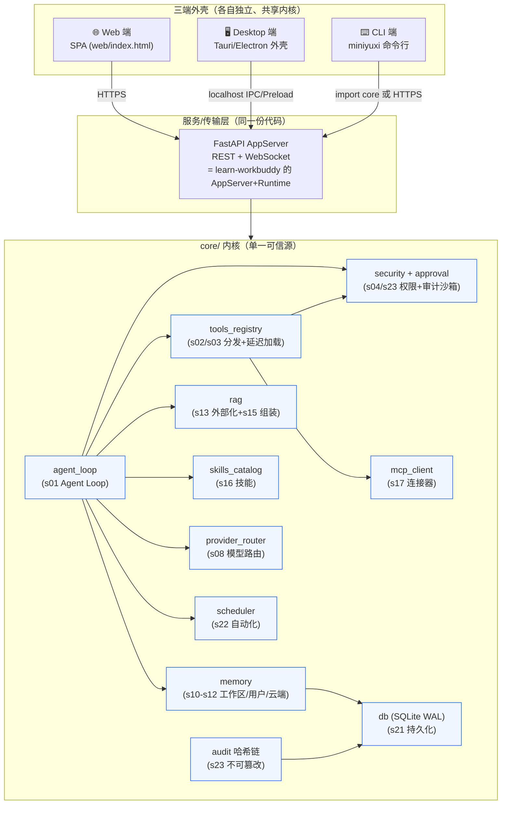

# 企业级 MiniYuxi：三端统一架构、核心模块与开源增长方案

> 组合拳：① 用 WorkBuddy 设计网页端原型（见 `web/prototype/index.html`）；② 参考 `learn-workbuddy` 攻坚桌面端；③ 依据 `agent-guide` 开源增长策略推动社区。
> 本文是「三端统一整体架构 + 可复用核心模块规划 + GitHub 项目结构与文档布局」的总纲，可直接作为开源仓库 `docs/architecture.md`。

---

## 0. 战略总览（组合拳映射）

| 组合拳 | 来源 | 在 MiniYuxi 的落点 |
|---|---|---|
| ① 网页端「最优最美观」 | DeepSeek 分享一 | 统一视觉规范 + 低 AI 存在感 + 意图预判；本方案已交付原型 `web/prototype/index.html` |
| ② 桌面端 / CLI 端 | `learn-workbuddy`（24 课复刻 WorkBuddy 架构） | 复用现有 Python 内核作 sidecar；CLI 作薄客户端 |
| ③ GitHub 受欢迎 | `agent-guide` + DeepSeek 分享一 | README=落地页 + 文档站 + 多渠道 + 速回 Issue/Discussion |

**一句话设计原则**：**core 内核是单一可信源，三端只是三种外壳**。Web / Desktop / CLI 共享同一套 `core/`（Agent Loop、工具注册表、RAG、安全、调度、技能、记忆、审计），差异只在「外壳与传输层」。这样三端功能永远一致、维护成本最低、最适合开源协作。

---

## 1. 三端统一整体架构

### 1.1 分层总图（mermaid，GitHub 直接渲染）



### 1.2 关键设计决策

1. **内核只写一次**：所有业务逻辑在 `core/`。三端不各自实现 Agent，只把请求送进内核。
2. **传输契约统一**：内核对外只暴露一套 REST（+WS 流式）契约 `api.py`。Desktop 走 `localhost`、CLI 走 `import` 或同契约，Web 走 `HTTPS`——三者看到的工具、记忆、权限完全一致。
3. **状态共享**：会话/用量/任务都落 `data/miniyuxi.db`（SQLite WAL）。三端**并发可读**，写经 `busy_timeout` 兜底（已优化 O1）。同一会话可在 Web 起头、Desktop 续看、CLI 取结果。
4. **安全不分端**：`hardline_block → 审批 → path 校验 → 审计` 全链路在 `core/security.py`，三端天然继承，桌面端多一层「子进程环境隔离」（见 learn-workbuddy `SECURITY.md`：工具命令不继承 provider 凭证/SSH agent）。
5. **可观测**：审计哈希链、token/成本账本（`s21`）对所有端统一记录。

---

## 2. 可复用核心模块规划

MiniYuxi 已具备 learn-workbuddy 24 课里的绝大部分机制，下面是**逐模块映射 + 接口边界 + 三端消费方式**。

| # | 核心模块（文件） | 对应 learn-workbuddy 课 | 职责 | 对三端的接口 | 缺口/待补 |
|---|---|---|---|---|---|
| 1 | `core/agent_loop.py` | s01 Agent Loop | ReAct 主循环、canonical↔api 消息、toolset 过滤 | `run(prompt, toolsets)` | 续跑 resume（B-2 未实施） |
| 2 | `core/tools_registry.py` | s02/s03 分发+延迟加载 | 工具注册、审批门 `run_tool_governed`、MCP 发现缓存 | `list_tools()` / `run_tool_governed()` | tool_search 渐进披露未做 |
| 3 | `core/security.py` + `approval` | s04/s23 权限+审计 | hardline 拦截、危险命令、路径校验、脚本校验 | `hardline_block()`/`is_dangerous_command()` | 异步审批队列未做 |
| 4 | `core/memory` | s10-s12 三层记忆 | 工作区/用户/云端 profile 注入 | `inject(tenant, session)` | 云端召回接检索 |
| 5 | `core/rag.py` | s13 外部化 / s15 组装 | 分词/分块/Embedding/检索/问答、预算 | `search()`/`answer()` | 大输出外部化指针 |
| 6 | `core/skills_catalog.py` | s16 技能 | SKILL.md 渐进加载、mtime 缓存 | `list_skills()`/`load(name)` | — |
| 7 | `core/mcp_client.py` | s17 连接器 | MCP 发现/信任/调用（60s TTL） | `discover_tools()` | 写入期信任工作流 |
| 8 | `core/provider_router.py` | s08 模型路由 | DeepSeek/OpenAI/Anthropic 归一、故障转移 | `complete(messages)` | — |
| 9 | `core/scheduler.py` | s22 自动化 | Cron=Agent 任务、fresh session、fail-closed | `run_job(payload)` | — |
| 10 | `core/db.py` | s21 持久化 | SQLite WAL + 韧性 pragma（O1） | `connect()` | — |
| 11 | `core/audit` | s23 审计沙箱 | append-only 哈希链 | `append(event)` | — |
| 12 | `api.py` | AppServer+Runtime | REST/WS 契约、RBAC、多租户 | HTTP 端点 | — |

**跨端消费约定**：
- **Web**：`fetch('/api/...')` → `api.py` → `core`。前端零业务代码。
- **Desktop**：外壳加载同一 SPA（或原生组件），经 `localhost` 调 `api.py`；重活（长会话、工具执行）全在 sidecar 内核。
- **CLI**：`from core import agent_loop` 直接 import（无服务进程也能量级跑），或 `curl` 同契约。

---

## 3. 桌面端攻坚（参考 learn-workbuddy）

### 3.1 选型

| 方案 | 包体 | 复用度 | 推荐度 |
|---|---|---|---|
| **Tauri + Python sidecar** | ~15MB | 直接复用现有 FastAPI 内核 | ⭐⭐⭐⭐⭐ 推荐 |
| Electron + Python sidecar | ~120MB | 复用内核，JS 生态熟 | ⭐⭐⭐ |
| 纯 Python（PyWebView/EFL） | 小 | 但要自己写 UI 框架 | ⭐⭐ |

**推荐 Tauri**：Rust 外壳极小；Python 内核以 **sidecar** 形式本地常驻（即把现有 `run.py` 当 sidecar server），Tauri 窗口加载 Web SPA，通过 `localhost` + 预加载桥（`preload` 把 `fetch` 代理到 sidecar）通信。这正是 learn-workbuddy 的「UI → Preload+IPC → Main → AppServer → Sidecar → Runtime → Agent」六层。

> ✅ **P3 已落地**（`apps/desktop/` + `run.py --sidecar` + `examples/desktop_tour` + `tests/test_desktop_sidecar.py`）。
> 完整通信契约、桌面六层细节、风险与验收见 [`docs/desktop.md`](desktop.md)。

### 3.2 桌面六层（对齐 learn-workbuddy Harness 总图）

```
Desktop UI (Tauri webview)         ← 复用 web/index.html
   ↓ Preload + IPC (窄桥)
Main Process (窗口/认证/配置)
   ↓
Local App Server (就是 MiniYuxi 的 api.py，sidecar 常驻)
   ↓
Session Runtime (会话常驻/恢复/重连 s07)
   ↓
Agent Loop (core/agent_loop)
   ├→ Tools Registry  ├→ Memory  ├→ RAG  ├→ Skills  ├→ Guard
```

### 3.3 必须解决的桌面专属问题（来自 learn-workbuddy）

| 痛点 | MiniYuxi 现状 | 桌面端动作 |
|---|---|---|
| 会话常驻/恢复/重连 | 单进程内 | ✅ sidecar 常驻；进程级重启走 `restart_sidecar` 命令（已落） |
| 工具上下文爆炸 | toolset 过滤已有 | ⏳ 加 `tool_search` 渐进披露（s03，未做） |
| 大输出塞不进 context | 无 | ⏳ 工具结果写磁盘、context 留指针（s13，未做） |
| 工具命令变后门 | `hardline_block` 已有 | ✅ 子进程环境隔离：sidecar 走强制回环 127.0.0.1 + LAN guard + token 仅 7 天（已落）；不继承 provider 凭证待 S23 收口 |
| 六层解耦 | 已分层 | ✅ 外壳只通过 `MINIYUXI_SIDECAR_READY` 契约 + `localhost`，不碰 `core` 内部（已落） |

### 3.4 验证（照搬 learn-workbuddy 的跑法）

```bash
# 用 Conda 管理 Python、uv 管理依赖（与 learn-workbuddy 一致）
conda env create -f environment.yml
conda activate miniyuxi
uv sync --python "$CONDA_PREFIX/bin/python" --no-python-downloads
# 离线跑完整链路（不填 key 也能验证桌面机制）
uv run python examples/desktop_tour/code.py        # 7 步验证外壳→sidecar→api.py→core/
uv run python tests/test_desktop_sidecar.py         # 单元(ttl)+ 端到端（tour）
```

> 注：MiniYuxi 当前用 `requirements.txt` + venv；开源后统一为 `environment.yml` + `uv` 以匹配社区习惯并支持 `uv sync` 一键复现。

---

## 4. CLI 端方案

CLI 是**最薄的客户端**，可分两级：
- **L0（零服务）**：`from core import agent_loop` 直接 import，单进程跑对话/脚本（`miniyuxi chat "..."`）。
- **L1（连服务）**：`miniyuxi --url http://localhost:8801 chat` 走同一 REST 契约，与 Web/Desktop 共享会话。

子命令规划（对标 learn-claude-code 谱系）：

```
miniyuxi chat       # 进入/单次对话
miniyuxi run        # 执行一个 Agent 任务（非交互）
miniyuxi skill      # 列出/加载技能
miniyuxi mcp        # 列出/信任 MCP 连接器
miniyuxi serve      # 启动本地 AppServer（= desktop sidecar）
miniyuxi doctor     # 端到端联通自检（复用 tests/selftest.py 20/20）
```

---

## 5. GitHub 项目结构与文档布局（参考 agent-guide）

### 5.1 单体仓库（monorepo）结构

```
miniyuxi/
├── apps/
│   ├── web/                 # 网页端 SPA（现有 web/index.html，构建产物）
│   ├── desktop/             # Tauri 外壳（src-tauri/ + src/）+ sidecar 启动
│   └── cli/                 # miniyuxi 命令行（Python 入口）
├── core/                    # ★ 共享内核（单一可信源，三端复用）
├── api.py                   # FastAPI AppServer（服务/传输层）
├── run.py                   # 启动器（serve）
├── web/prototype/           # WorkBuddy 设计的网页端原型（index.html）
├── docs/                    # 文档站（VitePress，等同 agent-guide 的 VuePress）
│   ├── architecture.md      # 本文
│   ├── desktop.md           # 桌面端接入（learn-workbuddy 路线）
│   ├── cli.md
│   ├── contributing.md
│   └── .vuepress/           # 配置/导航/侧边栏自动生成
├── examples/                # 离线可跑 demo（desktop_tour 等）
├── tests/                   # selftest 20/20 + hermes 13 + perf 5
├── scripts/verify.py        # 本地/CI 验证入口
├── .github/
│   ├── workflows/verify.yml # 提交/PR 卡点
│   ├── ISSUE_TEMPLATE/      # bug / feature / question
│   └── PULL_REQUEST_TEMPLATE.md
├── README.md                # ★ 落地页（中文）
├── README_en.md             # 英文落地页（稳定外链）
├── CONTRIBUTING.md
├── SECURITY.md
├── LICENSE                  # MIT
├── CHANGELOG.md
└── environment.yml          # Conda + uv 复现
```

### 5.2 README = 高转化落地页（照 agent-guide + 分享一）

- **顶部**：项目名称 + 一句话定位 + shields.io 徽章（build/license/stars/Python 版本）。
- **视觉锤**：一张三端统一工作台截图/GIF（用 `web/prototype/index.html` 录制或截图）。
- **Feature 网格**：多租户 / Agent 编排 / 知识库 RAG / 工具治理 / 安全审计 / 三端统一。
- **Quickstart 三段**：Web / Desktop / CLI 各一段可复制命令（参考 agent-guide 的「本地阅读与开发」块）。
- **明确 CTA**：「⭐ 如果这个项目对你有帮助，请给个 Star」放在首屏与文末。
- **中英文双 README**：`README_en.md` 提供英文永久链接，便于海外传播（agent-guide 做法）。

### 5.3 文档站（对标 agent-guide 技术栈）

- 用 **VitePress**（比 VuePress 更轻、构建快）搭在线阅读站，独立于 GitHub 源码。
- 侧边栏**按目录自动生成**（agent-guide 的 `sidebar.ts` 思路），新增文章无需手改菜单。
- 源码用中文目录，公开页用英文永久链接（`/architecture/` 等），保证长期可分享。
- 部署到 GitHub Pages / Vercel，README 顶部挂「在线文档」按钮。

---

## 6. 开源增长清单（agent-guide + 分享一 落地动作）

| 阶段 | 动作 | 来源 |
|---|---|---|
| 发布前 ✅ | README 落地页打磨（徽章/截图/CTA/SEO 标题含关键词） | 分享一 |
| 发布前 ✅ | 补齐 LICENSE/CONTRIBUTING/SECURITY/.github 模板 | 通用 |
| 发布前 ✅ | `scripts/verify.py` + Actions 绿，selftest 20/20 作为「质量凭证」展示 | learn-workbuddy |
| 发布日 | **Show HN**（标题含「self-hosted / local-first / no Docker」） | 分享一 |
| 发布日 | Reddit：r/selfhosted、r/LocalLLaMA、r/opensource（**不同内容，不刷屏**） | 分享一 |
| 发布日 | X/Twitter + LinkedIn 发「架构图 + 24 机制映射」技术洞察帖 | 分享一 |
| 发布日 | 微信公众号/掘金：发《从 0 到 1 打造三端统一企业级 AI 助手》 | agent-guide 经验 |
| 持续 | **回复每一个 Issue / Discussion**，并沉淀为 FAQ/博客 | 分享一（最有效涨星动作） |
| 持续 | 打 `good first issue` 标签，降低贡献门槛 | 通用 |
| 持续 | 上架技能市场（若 MiniYuxi 以 WorkBuddy Skill 形态发布，推 ClawHub） | 分享一 |
| 持续 | 固定节奏发 Release + CHANGELOG，配 benchmark 成绩单 | learn-workbuddy |
| 持续 | 文档站周更，稳定外链，SEO 优化 | agent-guide |

---

## 7. 落地路线图（分阶段，避免一次翻转）

| 阶段 | 目标 | 关键产出 | 风险 |
|---|---|---|---|
| **P0 内核固化** | 契约稳定、测试绿 | 本文架构 + 现有 38 测试 | 🟢 低（已具备） |
| **P1 网页原型** | 最优 UI | `web/prototype/index.html` → 升级为正式 SPA | 🟢 低 |
| **P2 CLI** | 薄客户端 | `apps/cli/miniyuxi` + `doctor` | 🟢 低 |
| **P3 桌面端** ✅ | Tauri sidecar | `apps/desktop/` + `run.py --sidecar` + `examples/desktop_tour` | 🟢 低（已落地 7/7 步贯通） |
| **P4 开源发布** | 涨星 | README 落地页 + 文档站 + .github | 🟢 低 |

---

## 8. 交付物清单（本方案已产出）

| 文件 | 说明 |
|---|---|
| `web/prototype/index.html` | 网页端原型（WorkBuddy 设计，三端切换可交互） |
| `docs/三端统一架构与开源增长方案.md` | 本文：架构 + 核心模块 + 项目结构 + 增长策略 |
| `docs/desktop.md` | P3 桌面端接入说明（通信契约 · 三条跑通路径 · 风险与验收） |
| `apps/desktop/` | P3 桌面端（Tauri 外壳 + Python sidecar） |
| `run.py --sidecar` | sidecar 常驻模式（READY 契约 · 优雅退出 · stdin 看门狗） |
| `examples/desktop_tour/code.py` | 离线贯通演示（7 步） |
| `tests/test_desktop_sidecar.py` | 桌面端自检（单元 ttl + 端到端 tour） |
| `scripts/build_sidecar.py` | PyInstaller 打 sidecar 可执行文件 |
| `README.md` ✅ | 开源落地页（徽章 ×4 + 真实截图 + MSI 下载 CTA + 关键词 SEO 标题） |
| `docs/assets/readme_hero.png` ✅ | README 首屏真实截图（`scripts/gen_readme_shot.py` 生成，非手改图） |
| `LICENSE` / `CONTRIBUTING.md` / `SECURITY.md` / `.github/` ✅ | 开源基建（Issue/PR 模板 + `verify.yml` 合并硬闸门） |
| `scripts/verify.py` ✅ | 一键质量闸门（本地与 CI 同构，补 §6 点名的入口） |
| 既有 `core/`、`api.py`、`tests/`（20/20 + 13 + 5 + 1 desktop = 39） | 已就绪的内核与质量凭证 |

> **P3 状态：已落地**——`examples/desktop_tour/code.py` 跑通 7/7 步，
> `tests/test_desktop_sidecar.py` 跑通 2/2。
>
> **P4 状态：发布前清单已清**——README 落地页（真实截图 + MSI CTA）、开源基建
> （LICENSE/CONTRIBUTING/SECURITY/.github）、`scripts/verify.py` 一键闸门均已完成，
> Actions 在 `b0a074c` 上 `conclusion: success`，Release `v0.2.2` 已挂 84MB MSI。
>
> **剩余为「发布日/持续」动作**（需本人拍板，属对外发布，不自动执行）：
> 1) Show HN（标题含 self-hosted / local-first / no Docker）；
> 2) Reddit r/selfhosted、r/LocalLLaMA、r/opensource（三处内容各异，不刷屏）；
> 3) X/LinkedIn 架构洞察帖；4) 公众号/掘金《从 0 到 1 打造三端统一企业级 AI 助手》；
> 5) 持续：回复每个 Issue/Discussion 并沉淀 FAQ、打 `good first issue`、固定节奏发 Release。
